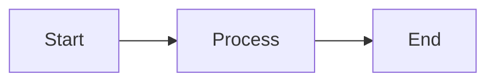

# Generate Mermaid diagram (Markdown code block)

Generate a Mermaid diagram as a **markdown code block** that can be pasted into docs or plans.

## What to do

1. **Ask** what the user wants to diagram (flow, sequence, architecture, state machine, etc.) if not clear from context.
2. **Choose** the right diagram type:
   - `flowchart` / `flowchart LR` or `TB` – processes, flows, pipelines
   - `sequenceDiagram` – interactions between actors over time
   - `stateDiagram-v2` – state machines
   - `erDiagram` – entity-relationship / schema
   - `classDiagram` – classes and relationships
3. **Output** only the diagram inside a fenced code block with language `mermaid`:



## Syntax rules (use these so diagrams render correctly)

- **Node IDs**: No spaces. Use `camelCase`, `PascalCase`, or underscores (e.g. `UserService`, `response_agent`). Bad: `User Service`.
- **Edge labels** with parentheses/brackets/special chars: wrap in quotes, e.g. `A -->|"O(1) lookup"| B`.
- **Node labels** with special characters: use double quotes, e.g. `A["Process (main)"]`, `B["Step 1: Init"]`.
- **Reserved IDs**: Avoid `end`, `subgraph`, `graph`, `flowchart` as node IDs; use e.g. `endNode[End]`.
- **Subgraphs**: Use explicit ID + label, e.g. `subgraph id [Label]` (e.g. `subgraph auth [Authentication]`).
- **No styling**: Do not use `style`, `classDef`, or `:::style`; they break in dark mode.
- **No `click`** (disabled for security).

## Commands you can give

- “Generate a flowchart for [description].”
- “Generate a sequence diagram for [interaction].”
- “Generate an architecture diagram for [system].”
- “Put the diagram in a mermaid code block I can copy.”

Always output the diagram as a **single markdown code block** with the first line as ` ```mermaid ` so it can be dropped into any `.md` file.
