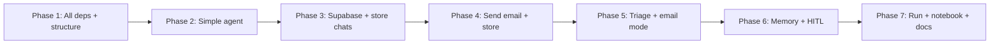
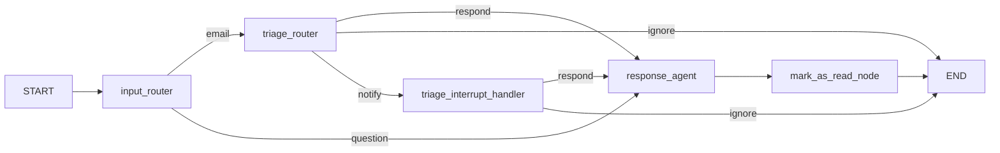
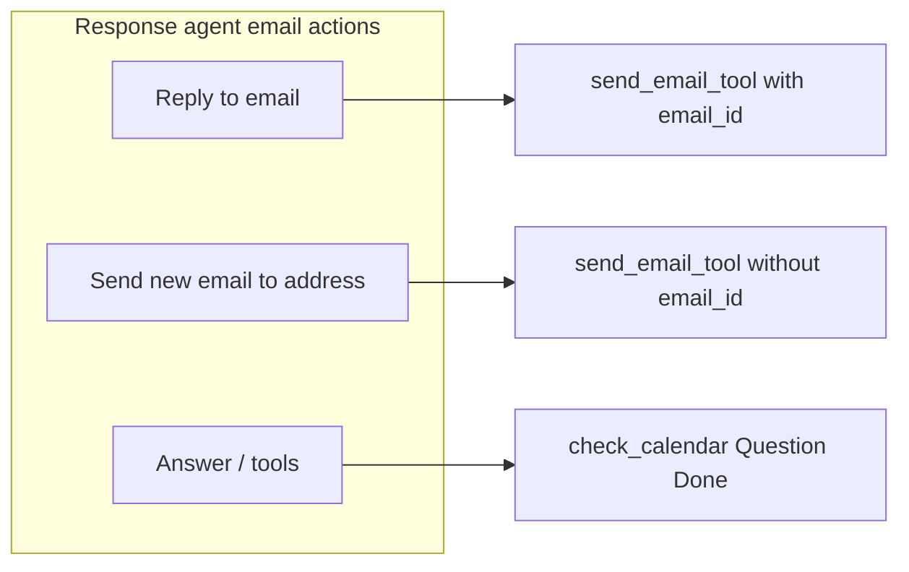
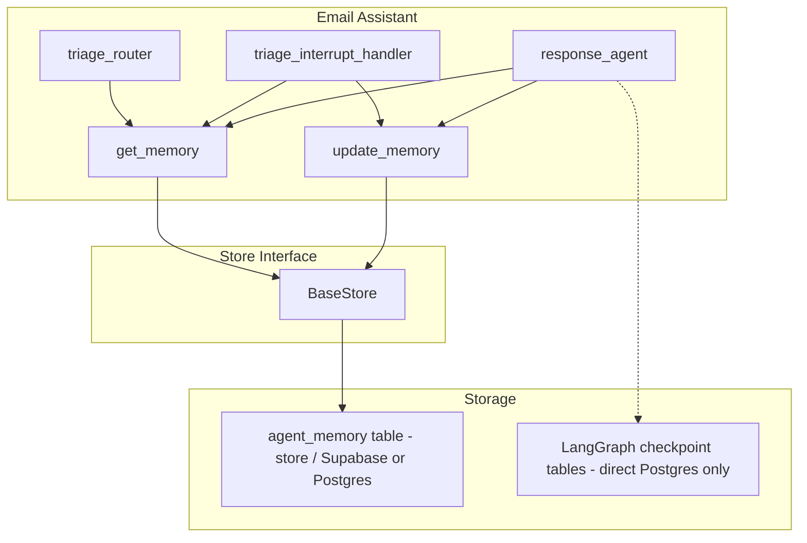

# Email Agent: Phased Implementation Plan

This plan splits the work into **seven phases** so you can build incrementally and track errors at each step. **Phase 1** installs **all** project dependencies and creates the **full** project structure. Phases 2–7 add features in order without adding new dependencies. Each phase section below contains the **full reference material** from the original design needed for that phase — no "see Part X" without the content.




---

## Shared context: What we're building

The agent is built with **LangGraph** and **connected to LangSmith** for tracing. It is a human-in-the-loop (HITL), memory-enabled assistant that (1) **processes emails** (triage, notify, respond with review) and (2) **answers general user questions** when the user asks something directly.

### Dual input mode

- **Email mode**: Input is an email payload (`email_input`). Flow is triage → ignore / notify / respond.
- **Question mode**: Input is a free-form user question (e.g. "What's on my calendar tomorrow?"). The agent responds directly—no triage.
- **Send new email on request**: The user can ask the agent to **send a new message to a specific Gmail address** (e.g. "Send an email to [john@gmail.com](mailto:john@gmail.com) saying …"). The agent can compose and send a **new** email, not only reply to incoming ones, in both question mode and respond path.

### High-level flow (email + question)




**Response agent** does three things: **(1)** reply to an incoming email (respond path), **(2)** send a **new** email to a specified Gmail address when the user asks (question path or respond path), **(3)** answer questions and use other tools (calendar, etc.):




- **input_router**: Inspects the request. If `email_input` is present and non-empty → **email** path (triage). If a **user question** is present (`user_message` or `question` and no email) → **question** path: go straight to **response_agent** with the question as the initial user message (no triage, no mark_as_read unless the conversation was about an email).
- **Question path**: `messages = [HumanMessage(content=user_question)]`; response_agent runs the same LLM + tools loop (answer, check_calendar, send_email if needed, Question, Done). No `mark_as_read_node` for pure Q&A (or run it only when the last turn was about an email and had an `email_id`).

### Email flow (unchanged from docs)

- **Triage**: One LLM call classifies each email as **ignore** / **notify** / **respond** using `RouterSchema` (reasoning + classification).
- **Notify path**: Email shown in Agent Inbox; user chooses respond (with optional feedback) or ignore; choice updates **triage_preferences** memory.
- **Respond path**: Response subgraph runs an LLM loop with tools; HITL tools (send_email, schedule_meeting, Question) go to Agent Inbox; when user accepts/edits/ignores/responds, memory may be updated; **Done** triggers mark-as-read and exit.

### State and nodes

- **State**: Extends `MessagesState` with `email_input` (dict or None), optional `user_message` / `question` (str) for question mode, and `classification_decision` (ignore | notify | respond). Messages hold the conversation for the response agent.
- **StateInput**: Accept either `email_input` (for email mode) or `user_message` / `question` (for question mode). Entry node decides which path to take.
- **Nodes**: `input_router` (new; Command or conditional edge), `triage_router` (Command), `triage_interrupt_handler` (Command), `response_agent` (subgraph), `llm_call`, `interrupt_handler`, `mark_as_read_node`. For question mode, `mark_as_read_node` is a no-op when there is no `email_id`. **HITL**: Nodes that need human-in-the-loop call `interrupt(...)` (from `langgraph.types`); the graph pauses and the caller resumes by invoking again with `Command(resume=...)` or `Command(goto="node_name")`.
- **Memory**: Same three namespaces under key `"user_preferences"`—triage, response, cal. Used for both email and question flows so the agent's style and preferences stay consistent.

### Question mode: behavior and prompt

- **Prompt**: Reuse the same response agent system prompt (background, response_preferences, cal_preferences, tools). For question mode, the initial user message is the question; the agent can use tools (e.g. check_calendar, fetch_emails, send_email) when relevant. Include in the system prompt: (1) "When the user asks a direct question (not an email), answer helpfully using your tools if needed." (2) "When the user asks you to **send an email** to a specific address, use send_email_tool to compose and send a **new** email to that recipient—you are not only replying to incoming emails."
- **mark_as_read**: In question mode there is no `email_input`/`email_id`, so `mark_as_read_node` should no-op (or skip) when `email_id` is absent. No change to the node contract—already "if email_id present, mark as read."

### External integrations

- **LangGraph**: The agent is implemented as a LangGraph state graph (top-level + response subgraph); nodes, conditional edges, interrupts, and store/checkpointer are all LangGraph primitives.
- **LangSmith**: The agent is **connected to LangSmith** for tracing, debugging, and monitoring. Runs (graph execution, LLM calls, tool calls) are sent to LangSmith when env vars are set; use the LangSmith UI to inspect traces, latency, and errors.
- **OpenAI**: Router LLM and response agent LLM (and memory-update LLM); structured outputs (`RouterSchema`, `UserPreferences`).
- **Gmail**: `send_email_tool` (both **reply** to an existing email and **send new** email to a specified address when the user asks), `mark_as_read`; optional `fetch_emails_tool` for ingestion and for answering questions about email.
- **Google Calendar** (optional): `check_calendar_tool`, `schedule_meeting_tool`—used for both email scheduling and for questions like "What's on my calendar?"
- **Storage**: Docs assume a LangGraph **checkpointer** (for HITL/resume) and a LangGraph **store** (for memory). No Supabase/Postgres in docs—your requirement adds these.

**References (current LangChain/LangGraph docs):** [LangGraph overview](https://docs.langchain.com/oss/python/langgraph/overview), [Graph API](https://docs.langchain.com/oss/python/langgraph/graph-api), [Interrupts](https://docs.langchain.com/oss/python/langgraph/interrupts), [Add memory](https://docs.langchain.com/oss/python/langgraph/add-memory), [Durable execution](https://docs.langchain.com/oss/python/langgraph/durable-execution).

### Configuration summary


| Concern           | Source                                                                     | Purpose                                    |
| ----------------- | -------------------------------------------------------------------------- | ------------------------------------------ |
| **LangGraph**     | (framework)                                                                | State graph, nodes, interrupts, store      |
| **LangSmith**     | `LANGCHAIN_TRACING_V2`, `LANGCHAIN_API_KEY`, optional `LANGCHAIN_PROJECT`  | Tracing, debugging, monitoring of runs     |
| **OpenAI**        | `OPENAI_API_KEY`, optional `OPENAI_MODEL`                                  | Router, response agent, memory-update LLMs |
| **Gmail**         | `GMAIL_TOKEN` or `.secrets/token.json`                                     | send_email, mark_as_read, fetch_emails     |
| **Calendar**      | Same Google OAuth (scopes)                                                 | check_calendar, schedule_meeting           |
| **Memory**        | Supabase project URL + key, or Postgres for `PostgresStore`                | Custom store / `agent_memory` table        |
| **Checkpointing** | Postgres connection string only (e.g. `DATABASE_URL`); not Supabase client | LangGraph `PostgresSaver`, own tables      |


---

## Phase 1: All dependencies and full project structure

**Goal:** Install **all** project dependencies in one go and create the **full** project structure (every directory and placeholder file). No feature code yet. After this phase the repo is ready for any later phase without adding new packages.

### Project setup (uv, venv, requirements)

- **uv**: Use [uv](https://docs.astral.sh/uv/) to create the virtual environment and install dependencies (faster than pip, single tool for venv + lockfile).
- **Virtual environment**: Create and use a venv in the project root (`.venv`). Commands:
  - `uv venv` — create `.venv`
  - `uv sync` — install dependencies from `pyproject.toml` (and lockfile) into the active venv
  - Activate: `source .venv/bin/activate` (Unix) or `.venv\Scripts\activate` (Windows).
- **Agent requirements** (in `pyproject.toml`; **all** in Phase 1, no staggered adds):
  - **LangGraph / LangChain**: `langgraph`, `langchain-openai`, `langchain-core`, `langchain-community` (if needed)
  - **LangSmith**: tracing works when `LANGCHAIN_TRACING_V2` and `LANGCHAIN_API_KEY` are set; no extra package beyond LangChain
  - **OpenAI**: `openai` (often pulled in by `langchain-openai`)
  - **Supabase / Postgres**: `supabase`; for Postgres checkpointer/store use `psycopg[binary,pool]` (recommended in current LangGraph docs), or `psycopg2-binary` if standardized
  - **Gmail / Google APIs**: `google-auth`, `google-auth-oauthlib`, `google-auth-httplib2`, `google-api-python-client`
  - **Checkpointer**: `langgraph-checkpoint-postgres` for `PostgresSaver`
  - **Utils**: `python-dotenv` for `.env` loading

Example `pyproject.toml`:

```toml
[project]
name = "email-assistant"
version = "0.1.0"
requires-python = ">=3.11"
dependencies = [
  "langgraph>=0.2",
  "langgraph-checkpoint-postgres",
  "langchain-openai",
  "langchain-core",
  "supabase",
  "psycopg[binary,pool]",
  "google-api-python-client",
  "google-auth-oauthlib",
  "google-auth-httplib2",
  "python-dotenv",
]
```

- **Workflow**: From repo root, run `uv venv`, activate the venv, run `uv sync`. Then run the agent with this venv so all imports resolve.

### File structure (full tree — create all as placeholders)

```
email_assist_draft/
├── docs/
│   ├── email-assistant-gmail/          # (existing) design docs
│   ├── PROJECT_OVERVIEW.md             # (after implementation) what the project does, how to run
│   ├── ARCHITECTURE.md                 # (after implementation) flow, graph, state, data flow
│   ├── CONFIGURATION.md                # (after implementation) env vars, .env.example, security
│   ├── DATABASE.md                     # (after implementation) schema, migrations, store/checkpointer
│   ├── FILES_AND_MODULES.md            # (after implementation) file-by-file guide
│   ├── PROMPTS.md                      # (after implementation) where prompts live, what they do
│   └── RUNNING_AND_TESTING.md          # (after implementation) how to run and test
├── src/
│   └── email_assistant/
│       ├── __init__.py
│       ├── email_assistant_hitl_memory_gmail.py   # Entry: build + compile graph
│       ├── schemas.py                  # State, StateInput, RouterSchema, UserPreferences
│       ├── prompts.py                  # Triage, agent, memory-update prompts; default_*
│       ├── utils.py                   # parse_gmail, format_gmail_markdown, format_for_display
│       ├── memory.py                  # get_memory, update_memory (store-agnostic)
│       ├── nodes/
│       │   ├── __init__.py
│       │   ├── input_router.py         # input_router: email vs question
│       │   ├── triage.py               # triage_router
│       │   ├── triage_interrupt.py     # triage_interrupt_handler
│       │   ├── response_agent.py       # Subgraph: llm_call, interrupt_handler, mark_as_read
│       │   └── mark_as_read.py         # mark_as_read_node (no-op when no email_id)
│       ├── tools/
│       │   ├── __init__.py             # get_tools(include_gmail=...)
│       │   ├── gmail/
│       │   │   ├── __init__.py
│       │   │   ├── prompt_templates.py # GMAIL_TOOLS_PROMPT
│       │   │   ├── send_email.py       # send_email_tool
│       │   │   ├── fetch_emails.py     # fetch_emails_tool (optional)
│       │   │   ├── mark_as_read.py     # mark_as_read
│       │   │   └── calendar.py        # check_calendar_tool, schedule_meeting_tool
│       │   └── common.py               # Question, Done
│       └── db/
│           ├── __init__.py
│           ├── store.py               # Store for memory: PostgresStore or custom BaseStore
│           └── checkpointer.py        # Wrapper/config for PostgresSaver
├── scripts/
│   └── run_agent.py                    # Run agent (stub)
├── migrations/                         # DB schema (folder ready; SQL added in Phase 3)
├── notebooks/
│   └── run_agent_sdk.ipynb             # (added in Phase 7)
├── tests/
├── .env.example                        # All env vars as placeholders
├── .venv/                             # Virtual environment (uv venv)
├── pyproject.toml                     # Project and dependencies (uv)
└── README.md                          # Minimal: project name and how to run uv sync
```

- **Entry point**: `src/email_assistant/email_assistant_hitl_memory_gmail.py` — builds the top-level graph (START → input_router → email path or question path), response subgraph, and conditional edges, compiles with checkpointer and store. Invocation can pass either `email_input` or `user_message`/`question`.
- **Memory**: `src/email_assistant/memory.py` — keeps `get_memory` / `update_memory` unchanged in signature; they take a LangGraph `store`. Nodes that need the store receive it via the **Runtime** argument (`runtime.store`) when the graph is compiled with `store=...`.
- **DB layer**: `src/email_assistant/db/store.py` implements or configures the store; `src/email_assistant/db/checkpointer.py` creates the Postgres checkpointer (e.g. from `DATABASE_URL`).

### .env.example

Document **all** env vars as placeholders:

```
# OpenAI
OPENAI_API_KEY=
OPENAI_MODEL=gpt-4o

# LangSmith
LANGCHAIN_TRACING_V2=true
LANGCHAIN_API_KEY=
LANGCHAIN_PROJECT=email-assistant

# Google / Gmail
GOOGLE_TOKEN_PATH=.secrets/token.json

# Supabase
SUPABASE_URL=
SUPABASE_KEY=

# Postgres (checkpointer + optional store)
DATABASE_URL=
```

### Phase 1 deliverable

From repo root: `uv venv`, activate venv, `uv sync`. Full directory tree and **all** placeholder files exist. All imports for the full project (LangGraph, LangChain, Supabase, Gmail, checkpointer) resolve. No feature code yet.

### Phase 1 checklist

- `pyproject.toml` has **all** dependencies above (not minimal)
- `.env.example` documents all env vars
- All directories and `__init__.py` in place per the tree above
- All module files exist as stubs (no real logic)
- `scripts/run_agent.py` stub; `migrations/`, `tests/`, `notebooks/` dirs present
- `README.md` with project name and how to run `uv sync`
- `uv sync` succeeds; venv activates; no import errors

---

## Phase 2: Simple agent (user message → response)

**Goal:** Build a **minimal agent** that accepts a **user message** and **returns a response**. No Supabase, no database, no email sending. Use only LangGraph, OpenAI, and optional LangSmith. Validate that the stack works end-to-end.

### What to build

- **State:** Use LangGraph `MessagesState` only (messages list with `add_messages` reducer).
- **Graph:** Single node: call ChatOpenAI with `state["messages"]`, append response to messages. Edges: START → node → END.
- **Checkpointer:** Use `InMemorySaver()` so you can pass `config={"configurable": {"thread_id": "..."}}` and get multi-turn in memory.
- **Entry point:** One module (e.g. `src/email_assistant/simple_agent.py` or the same file you'll extend later) that builds this graph and exposes `graph = builder.compile(checkpointer=InMemorySaver())`.
- **Run:** Small script or notebook: invoke with `{"messages": [HumanMessage(content="Hello")]}` and same `thread_id`; print last message.

### OpenAI reference

- **Where**: Response node calls `ChatOpenAI` (from `langchain-openai`). Later phases add structured outputs (`RouterSchema`, `UserPreferences`) and `bind_tools`.
- **Config**: Use `OPENAI_API_KEY`; model choice (e.g. `gpt-4o`) in env or config. All LLM calls go through LangChain's `ChatOpenAI` so one place to set model and key.
- **Files**: Prompts in `prompts.py`; schemas in `schemas.py`; nodes in `nodes/` that invoke the LLM.

### LangSmith reference

- **Role**: LangChain/LangGraph automatically send traces to LangSmith when the environment is configured, so you get visibility into graph runs, LLM calls, tool invocations, latency, and errors without extra code.
- **Configuration**: Set `LANGCHAIN_TRACING_V2=true`, `LANGCHAIN_API_KEY` (your LangSmith API key), and optionally `LANGCHAIN_PROJECT`. These live in `.env` and are loaded before invoking the graph.
- **Usage**: Invoke the compiled graph as usual; runs will appear in the LangSmith dashboard. Use them to debug routing, inspect tool inputs/outputs, and monitor performance.
- **Where**: No new files strictly required; ensure env is set in `run_agent.py` or wherever the graph is invoked. Optionally centralize in a small config module that loads `os.environ` for LangSmith (and other keys).

### Phase 2 deliverable

You can send a user message (via a small script or notebook) and receive an LLM response. Multi-turn works via InMemorySaver and thread_id. No DB, no store, no email code.

### Phase 2 checklist

- One node or chain that takes user text and returns assistant text
- Invocation works with `OPENAI_API_KEY` (and optional LangSmith tracing)
- Multi-turn works in same thread_id
- No DB, no store, no email code

---

## Phase 3: Supabase tables and store simple agent chats

**Goal:** Create **all application tables** in Supabase/Postgres, implement the **store** and **checkpointer**, and **persist the simple agent's messages** to Supabase (queryable chat history). The agent's behavior is unchanged (still just question → response); what changes is that conversations are now stored.

### Supabase vs checkpointer — roles

- **Memory (user preferences)** and **app tables** (users, chats, messages, agent_memory): Use Supabase (or your own Postgres) for application data. The store backs the three namespaces (`triage_preferences`, `response_preferences`, `cal_preferences`) and can be implemented with Supabase client, PostgresStore, or a custom BaseStore.
- **Checkpointing**: The **checkpointer is separate** from Supabase. It connects to **Postgres via a direct connection string** (e.g. `DATABASE_URL`) and stores graph state (thread_id, checkpoints) in **LangGraph's own tables**, created by `checkpointer.setup()`. It does not use the Supabase client or REST API—it is a direct Postgres-backed persistence layer. You can point it at the same Postgres instance Supabase uses (if you have the connection string) or at a different Postgres; either way, connection and storage are handled by LangGraph's `PostgresSaver`, not by Supabase.

### Memory store (Supabase/Postgres)

- **Interface**: Use a store that implements LangGraph's `BaseStore`: at least `get(namespace, key)`, `put(namespace, key, value)`; optionally `delete`, `list_namespaces`, and batch for efficiency. **Option**: If the app uses a single Postgres (e.g. Supabase's Postgres) for both checkpoints and memory, use the built-in `PostgresStore` from `langgraph.store.postgres` with `PostgresStore.from_conn_string(DATABASE_URL)` and `store.setup()` on first use (same package as the checkpointer). Otherwise implement a custom store (e.g. SupabaseStore) that implements `BaseStore`.
- **Scoping (cross-chat)**: User preferences (triage_preferences, response_preferences, cal_preferences) are **per user, not per chat**. They persist **across all conversations** so the agent "learns" the same preferences everywhere (e.g. "prefer short emails," "notify for deploy notices"). The store keys on `(user_id, namespace, key)` only; `chat_id` is not used for these namespaces. In the DB, use `chat_id = NULL` in `agent_memory` for user-level preferences.
- **Usage**: In `email_assistant_hitl_memory_gmail.py`, create the store from config, pass it into `compile(..., store=...)`. Nodes that need the store receive it via the **Runtime** argument (`runtime.store`). No changes to `get_memory`/`update_memory` in `memory.py`—they keep using `store.get`/`store.put`. The store implementation must receive `user_id` (and optionally `chat_id`; for preferences, ignore it and use NULL in the table).

### Database schema (SQL)

Create `migrations/001_email_assistant_tables.sql` and run against Supabase/Postgres:

```sql
CREATE SCHEMA IF NOT EXISTS email_assistant;

CREATE TABLE IF NOT EXISTS email_assistant.users (
  user_id         UUID PRIMARY KEY DEFAULT gen_random_uuid(),
  email           TEXT,
  created_at      TIMESTAMPTZ NOT NULL DEFAULT now(),
  updated_at      TIMESTAMPTZ NOT NULL DEFAULT now()
);

CREATE TABLE IF NOT EXISTS email_assistant.chats (
  chat_id         UUID PRIMARY KEY DEFAULT gen_random_uuid(),
  user_id         UUID NOT NULL REFERENCES email_assistant.users(user_id) ON DELETE CASCADE,
  title           TEXT,
  created_at      TIMESTAMPTZ NOT NULL DEFAULT now(),
  updated_at      TIMESTAMPTZ NOT NULL DEFAULT now()
);

CREATE INDEX IF NOT EXISTS idx_chats_user_id ON email_assistant.chats(user_id);

CREATE TABLE IF NOT EXISTS email_assistant.messages (
  message_id      UUID PRIMARY KEY DEFAULT gen_random_uuid(),
  chat_id         UUID NOT NULL REFERENCES email_assistant.chats(chat_id) ON DELETE CASCADE,
  user_id         UUID NOT NULL REFERENCES email_assistant.users(user_id) ON DELETE CASCADE,
  role            TEXT NOT NULL CHECK (role IN ('user', 'assistant', 'system', 'tool')),
  content         TEXT,
  metadata        JSONB DEFAULT '{}',
  created_at      TIMESTAMPTZ NOT NULL DEFAULT now()
);

CREATE INDEX IF NOT EXISTS idx_messages_chat_id ON email_assistant.messages(chat_id);
CREATE INDEX IF NOT EXISTS idx_messages_user_id ON email_assistant.messages(user_id);
CREATE INDEX IF NOT EXISTS idx_messages_created_at ON email_assistant.messages(chat_id, created_at);

ALTER TABLE email_assistant.messages
  ADD COLUMN IF NOT EXISTS email_id TEXT;

CREATE TABLE IF NOT EXISTS email_assistant.agent_memory (
  id              BIGSERIAL PRIMARY KEY,
  user_id         UUID NOT NULL REFERENCES email_assistant.users(user_id) ON DELETE CASCADE,
  chat_id         UUID REFERENCES email_assistant.chats(chat_id) ON DELETE CASCADE,
  namespace       TEXT NOT NULL,
  key             TEXT NOT NULL DEFAULT 'user_preferences',
  value           TEXT,
  updated_at      TIMESTAMPTZ NOT NULL DEFAULT now(),
  UNIQUE (user_id, chat_id, namespace, key)
);

CREATE INDEX IF NOT EXISTS idx_agent_memory_user_chat ON email_assistant.agent_memory(user_id, chat_id);
CREATE INDEX IF NOT EXISTS idx_agent_memory_namespace ON email_assistant.agent_memory(user_id, namespace);
```

- **users**: Optional; use if you own user creation. Otherwise drop the table and FK references and use `user_id` as a plain UUID referencing your auth system.
- **chats**: One row per conversation; `chat_id` is the LangGraph `thread_id` passed in config.
- **messages**: One row per message; `role` and `content` align with LangChain message types; `metadata` can store `email_id`, tool_calls, etc. This table is **optional** and intended for **queryable chat history** (e.g. for a UI or analytics). If you use it, write rows in a **post-run hook** (after the graph run) or from node code after each turn, syncing from the checkpoint state (`state["messages"]`). If you do not need queryable history, you can omit writing to `messages` and rely only on LangGraph checkpoints for conversation state.
- **agent_memory**: Backs the custom store. For user preferences (triage, response, cal), use `chat_id = NULL` so preferences are shared across all chats for that user. `get`/`put` use `(user_id, namespace, key)` with `chat_id` NULL.

### Checkpointer (direct Postgres, not Supabase)

The checkpointer **does not connect through Supabase**. It uses a **direct Postgres connection** and writes to **LangGraph's own checkpoint schema** (separate from your app tables).

- **Connection**: Use LangGraph's `PostgresSaver` with a **Postgres connection string** (e.g. `DATABASE_URL`). Call `checkpointer.setup()` once so LangGraph creates its checkpoint tables (no manual SQL). Create the checkpointer with `with PostgresSaver.from_conn_string(DATABASE_URL) as checkpointer:` then `graph = builder.compile(checkpointer=checkpointer)` inside the block; or hold a long-lived connection and pass the same checkpointer into `compile()`. For async, use `AsyncPostgresSaver` from `langgraph.checkpoint.postgres.aio` with `async with AsyncPostgresSaver.from_conn_string(DATABASE_URL) as checkpointer:`.
- **If you have no direct Postgres URI**: If you only have Supabase's REST API and no direct Postgres connection string, you cannot use `PostgresSaver` as-is; you would need a custom checkpointer or use a Postgres connection string (e.g. from Supabase's "Connection string" in project settings).
- **Config**: Store a **Postgres connection string** (`DATABASE_URL`) in env for the checkpointer; `db/checkpointer.py` can expose `get_checkpointer()` or a factory (or use the context manager at app startup). This is separate from Supabase URL/key used for the Supabase client.

**How checkpointer storage works (from docs/source):** The checkpointer stores graph state in **LangGraph-owned tables** created by `checkpointer.setup()`. You do not create these tables yourself; `setup()` runs migrations that create:

- `checkpoint_migrations` – tracks migration version (`v INTEGER PRIMARY KEY`).
- `checkpoints` – one row per checkpoint: `thread_id`, `checkpoint_ns`, `checkpoint_id`, `parent_checkpoint_id`, `type`, `checkpoint` (JSONB, state snapshot), `metadata` (JSONB). Primary key: `(thread_id, checkpoint_ns, checkpoint_id)`.
- `checkpoint_blobs` – non-primitive channel values (e.g. message lists) stored as blobs; keyed by `(thread_id, checkpoint_ns, channel, version)`.
- `checkpoint_writes` – pending writes per checkpoint/task; keyed by `(thread_id, checkpoint_ns, checkpoint_id, task_id, idx)` (and optional `task_path`).

Connection requirements for `PostgresSaver.from_conn_string()`: `autocommit=True` (so `setup()` can commit migrations) and `row_factory=dict_row` (implementation uses dict-style row access). The library sets these when you use `from_conn_string()`. See [Persistence](https://docs.langchain.com/oss/python/langgraph/persistence) and [Add memory](https://docs.langchain.com/oss/python/langgraph/add-memory); implementation: `langgraph-checkpoint-postgres` (e.g. `langgraph/checkpoint/postgres/base.py` MIGRATIONS).

### Data flow (memory + checkpointing)




### Phase 3 deliverable

`migrations/001_email_assistant_tables.sql` created and run. Tables exist in Supabase/Postgres (users, chats, messages, agent_memory). `db/store.py` implements or configures the store (e.g. PostgresStore or custom). `db/checkpointer.py` creates PostgresSaver; `checkpointer.setup()` (and optionally `store.setup()`) run once. **Messages from the agent (user + assistant) are persisted** to the `messages` table after each run. Agent behavior unchanged (still question → response).

### Phase 3 checklist

- SQL migration run; users, chats, messages, agent_memory tables exist
- Store implemented (`BaseStore` or `PostgresStore`); `store.setup()` if needed
- Checkpointer from `DATABASE_URL`; `checkpointer.setup()` run; checkpoint tables created
- Agent writes messages to Supabase messages table when it runs
- Config: `DATABASE_URL` and/or Supabase URL/key in `.env`

---

## Phase 4: Send email from user message and store to Supabase

**Goal:** Add the ability for the user to ask the agent to **send an email** (e.g. "Send an email to [john@gmail.com](mailto:john@gmail.com) saying …"). Implement **send_email_tool** (new email to a specified address, no `email_id`). Continue **storing all messages** to Supabase.

### Gmail reference

- **Gmail**: Implement `send_email_tool`, `mark_as_read`, and optionally `fetch_emails_tool` using Gmail API (OAuth token from env or `GOOGLE_TOKEN_PATH` / `token.json`). Keep `parse_gmail` and `format_gmail_markdown` in `utils.py` for Gmail-style and mock inputs. **First run**: On first run, the Google OAuth flow opens a browser for user consent and writes `token.json`; subsequent runs reuse this file without prompting.
- **send_email_tool – two use cases**:
  - **Reply to an email**: When the user is responding to an incoming email, call with `email_id` (and `response_text`, etc.) so the sent message is a reply in that thread. (Implemented later in Phase 5.)
  - **Send a new email to a specific address**: When the user asks to "send a message to X" or "email Y with subject Z", call **without** `email_id`, with `email_address` (recipient) and the composed subject/body. The tool should use Gmail API to create and send a **new** message to that recipient, not only reply. Tool signature must support optional `email_id` (omit for new email) and required recipient + content for new emails.
- **Calendar**: Implement `check_calendar_tool` and `schedule_meeting_tool` with Google Calendar API if needed. (Optional for this phase.)
- **Files**: `tools/gmail/` for Gmail/calendar tools (e.g. `send_email.py` handles both reply and new-email); `tools/gmail/prompt_templates.py` for GMAIL_TOOLS_PROMPT. Wire these in `nodes/response_agent.py` when building the response subgraph.

### OpenAI + tools reference

- **Where**: Response agent uses `llm.bind_tools(tools, tool_choice="required")`. Include send_email_tool in the tools list. Add minimal "Done" or "Question" tool if you want the agent to signal end or ask for clarification.
- **Prompt**: In system prompt, tell the model: "When the user asks you to send an email to a specific address, use send_email_tool without email_id: provide recipient, subject, and body."

### What to build in Phase 4

- Implement `send_email_tool` in `tools/gmail/send_email.py`: given recipient, subject, body (and no `email_id`), call Gmail API to send a **new** message.
- Set up Google OAuth (`token.json`), add Gmail send scope.
- Expose the tool to the LLM (`bind_tools` on ChatOpenAI).
- Extend the Phase 2 graph to a "response" node that calls the LLM with tools and handles tool calls (tool-call loop).
- All messages still stored in Supabase (Phase 3 persistence).

### Phase 4 deliverable

User can send a message like "Email [sarah@company.com](mailto:sarah@company.com) with subject Hello and say thanks." Agent uses send_email_tool (new email) and the email is sent via Gmail. All messages (user + assistant) are still stored in Supabase.

### Phase 4 checklist

- `send_email_tool` implemented; supports new email (no email_id, with recipient/subject/body)
- Gmail OAuth and `token.json` working
- Agent has tools bound to LLM; system prompt instructs "send email to X" → use tool
- Tool-call loop: LLM calls tool → tool runs → result back to LLM → next step
- Messages still persisted to Supabase

---

## Phase 5: Email triage and email mode (email_input → triage → respond/notify/ignore)

**Goal:** Add **email mode**: input can be an **email payload** (`email_input`). Implement **input_router** (email vs question), **triage_router** (classify as ignore/notify/respond), and conditional edges. The notify path has `interrupt()` for user choice. The respond path runs response_agent. Extend `send_email_tool` to support reply (`email_id`). Add `mark_as_read`.

### What to build

- **State:** Extend state with `email_input` (dict or None), `classification_decision` (ignore | notify | respond). Keep `MessagesState` for the response agent.
- **StateInput:** Accept either `email_input` (for email mode) or `user_message`/`question` (for question mode).
- **input_router:** If `email_input` present → triage path. If only user message/question → existing question path (Phase 2/4).
- **triage_router:** One LLM call with structured output (`RouterSchema`: reasoning + classification). Use triage prompts below.
- **Notify path:** After "notify", call `interrupt(...)` (HITL) so the user can choose "respond" or "ignore"; resume with `Command(resume=...)` or `Command(goto=...)`.
- **Respond path:** Invoke the response agent subgraph with the email context and `email_id` so the agent can reply.
- **Extend send_email_tool:** Support `email_id` for replying (Gmail "send as reply to message").
- **mark_as_read:** Implement in `tools/gmail/mark_as_read.py` and in `nodes/mark_as_read.py` (no-op when no email_id).

### Triage prompts (full prompt design)

All prompts in `prompts.py` and `tools/gmail/prompt_templates.py` should be written to be **as strong as possible**: clear role and task, explicit constraints, minimal ambiguity, and guardrails.

**General principles:**

- **Role and identity**: Start with a single, concrete role (e.g. "You are an email triage assistant for …"). Include the user's **background** so the model can tailor triage and replies.
- **Task in one place**: State the exact task in one short paragraph (e.g. "Classify this email into exactly one of: ignore, notify, respond.").
- **Output format and schema**: Tie prompts to structured output (e.g. `RouterSchema`, `UserPreferences`). Restate required fields and allowed values so the model does not invent labels.
- **Constraints and prohibitions**: List what the model must not do (e.g. "Do not reply to emails that are classified ignore." "Do not call more than one tool in a single response." "Do not make up email addresses or calendar events.").
- **Reasoning when useful**: Ask for brief step-by-step reasoning (e.g. "reasoning" field) so the model commits to a chain of thought.
- **Today's date**: Inject the current date ("Today's date is YYYY-MM-DD.") so scheduling references are grounded.
- **Examples (few-shot)**: 1–2 short examples for edge cases (notify vs respond, new email vs reply).

**Triage prompts (`triage_system_prompt`, `triage_user_prompt`):**

- **System**: State role ("You are an email triage assistant."), inject **background** and **triage_instructions** from memory (with clear section headers). Define the three categories with crisp criteria: **ignore** (no action, low value), **notify** (user should see it but no reply), **respond** (needs a direct reply or action). Add: "You must output exactly one classification. Prefer notify over ignore when in doubt; prefer respond only when a direct reply or meeting/action is clearly needed."
- **User**: Provide From, To, Subject, and the full **email_thread** in a fixed format (e.g. markdown). End with: "Classify the above email into exactly one of: ignore, notify, respond. Output your reasoning and then your classification."
- **Defaults**: `default_triage_instructions` should be detailed bullet lists with concrete examples (e.g. "Ignore: marketing newsletters, automated receipts, out-of-office replies." "Notify: deploy completions, HR deadline reminders." "Respond: direct questions, meeting requests, client or manager asks.").

**Response agent prompt (`agent_system_prompt_hitl_memory`):**

- **Structure**: (1) Role and background, (2) **response_preferences** and **cal_preferences** from memory, (3) **tools_prompt** (GMAIL_TOOLS_PROMPT) with explicit tool names and when to use each, (4) **Rules** block: one tool per turn; use Question when context is missing; for emails use send_email (reply or new); for meetings use check_calendar then schedule_meeting then send_email and Done; today's date, (5) **Question mode**: "If the user asks a direct question (no email attached), answer using your tools as needed. If they ask to send an email to a specific address, use send_email_tool without an email_id.", (6) **Prohibitions**: "Do not invent recipients, events, or email content. Do not send email without using send_email_tool. When in doubt, use Question to ask the user."
- **Tool list (GMAIL_TOOLS_PROMPT)**: Keep tool names and signatures in sync with actual tools. Explicitly state: "send_email_tool: use with email_id for replies; use without email_id (only email_address, subject, body) to send a **new** email to a specified recipient."
- **Today's date**: Always inject "Today's date is {date}." in the system prompt.

**Where to implement:** All prompts in `src/email_assistant/prompts.py` (triage, response agent, memory update, default_* content) and `src/email_assistant/tools/gmail/prompt_templates.py` (GMAIL_TOOLS_PROMPT). Keep prompts in version-controlled templates; avoid hardcoding long strings inside node code. Review and tighten prompts when adding new tools or when triage/response quality drifts (use LangSmith traces to spot confusion).

### Phase 5 deliverable

Top-level graph: START → input_router → (email → triage_router → ignore | notify | respond; question → response_agent). Triage uses RouterSchema and triage prompts. Notify path has interrupt() so the user can choose respond or ignore. Respond path goes to response_agent with email context; send_email_tool supports reply (email_id) and new email; mark_as_read when done. Chats still in Supabase.

### Phase 5 checklist

- `schemas.py`: State with email_input, classification_decision; StateInput; RouterSchema
- `prompts.py`: triage_system_prompt, triage_user_prompt, default_triage_instructions; agent_system_prompt_hitl_memory
- `tools/gmail/prompt_templates.py`: GMAIL_TOOLS_PROMPT
- `nodes/input_router.py`: routes email_input → triage, user_message → response_agent
- `nodes/triage.py`: LLM + RouterSchema structured output
- `nodes/triage_interrupt.py`: interrupt() for notify; resume with Command(resume=...)
- `nodes/response_agent.py`: subgraph with llm_call, interrupt_handler
- `nodes/mark_as_read.py`: no-op when no email_id
- `send_email_tool` now supports email_id for reply
- Conditional edges wired per flow diagram
- Optionally wrap side-effectful logic (e.g. Gmail API calls) in `@task` from `langgraph.func` for correct replay when using durable execution

---

## Phase 6: Memory (user preferences) and HITL polish

**Goal:** User preferences (triage, response, cal) stored in the store and injected into prompts. HITL for send_email/schedule_meeting approval. Memory-update LLM after user feedback. Optional Postgres checkpointer for production durability.

### Memory in graph

- `memory.py`: `get_memory(store, user_id, namespace)` → `store.get(...)` ; `update_memory(store, user_id, namespace, value)` → `store.put(...)`. Nodes receive store via `runtime.store`.
- **Scoping**: Preferences are per user (chat_id = NULL in agent_memory). Namespaces: `triage_preferences`, `response_preferences`, `cal_preferences`.
- **Prompts**: Triage system prompt includes `triage_instructions` from `get_memory(triage_preferences)`. Response agent system prompt includes `response_preferences` and `cal_preferences`.
- Compile graph with `store=...` so nodes can access `runtime.store`.

### HITL (interrupts)

- Nodes that need human-in-the-loop call `interrupt(...)` from `langgraph.types`. Graph pauses; caller invokes again with `Command(resume=<user_choice>)` (same thread_id).
- Use for: notify (respond/ignore), send_email approval, Question tool when agent asks the user something.

### Memory-update LLM and prompts

The memory-update LLM uses `llm.with_structured_output(UserPreferences)` to produce the updated profile.

- **Role**: "You update the user's preference profile based only on the provided feedback. You do not invent or assume preferences."
- **Rules**: (1) Output the **full** updated profile text (entire string to store), not a diff. (2) Change only what the feedback justifies; leave all other sentences unchanged. (3) Preserve tone and structure (bullets, sections). (4) Do not add generic advice; only add or correct specific, stated preferences.
- **Steps**: "(1) Read the current profile. (2) Read the feedback messages. (3) Identify which part of the profile the feedback refers to. (4) Update only that part. (5) Output the complete new profile."
- **Reinforcement**: When appending `MEMORY_UPDATE_INSTRUCTIONS_REINFORCEMENT`, repeat: "Output the full updated profile. No diffs. Targeted changes only."

### Checkpointer (optional upgrade)

Move from InMemorySaver to Postgres checkpointer (`PostgresSaver`) with `checkpointer.setup()` so threads persist across restarts. Use same `thread_id` in config. For production, you may set `durability="sync"` when calling `stream()` for maximum checkpoint durability.

### Phase 6 deliverable

Full agent: question mode, email mode, triage, notify/respond, preferences in store (injected into prompts), HITL for sensitive actions, memory-update LLM after user feedback, optional durable checkpointer.

### Phase 6 checklist

- `get_memory` / `update_memory` used in triage and response nodes
- Memory-update LLM and prompts; `update_memory` called after user feedback
- `interrupt()` in triage_interrupt_handler and response_agent where appropriate
- Resume with `Command(resume=...)` documented or scripted
- Checkpointer and store in `compile()`; `thread_id` in config
- Preferences injected into triage and response agent prompts

---

## Phase 7: Run script, notebook, and documentation

**Goal:** Easy ways to run the agent (script and notebook) and full post-implementation documentation so the project is self-documented.

### Run script

`scripts/run_agent.py` — loads `.env` (python-dotenv), builds or imports the compiled graph (with checkpointer/store from config), and invokes with `email_input` or `user_message`/`question` and `thread_id` (and `user_id` if needed). Ensure Google OAuth is set up: on first run, the OAuth flow opens a browser for consent and writes `token.json`; subsequent runs reuse it.

### Notebook (SDK)

A Jupyter notebook that **loads the compiled agent** from the project and runs it via the SDK so you can try email mode, question mode, and HITL resume.

**Purpose:** Run the email assistant by importing the graph and calling `invoke()` (and optionally `stream()`) with config and input; handle interrupts by resuming with `Command(resume=...)`. The notebook does not implement the agent—it uses the graph built in `src/email_assistant/`.

**Prerequisites:** Agent implemented and exposed (e.g. `email_assistant` in `email_assistant_hitl_memory_gmail.py`); venv activated and kernel set to that venv; `.env` (or env vars) for `OPENAI_API_KEY` and optional LangSmith/Gmail/Postgres.

**Notebook structure (cells):**

1. **Setup**: Add repo root to `sys.path`; load `.env` with `python-dotenv` so env vars are set before any LangGraph/LangChain imports.
2. **Imports**: Import the compiled graph (e.g. `from src.email_assistant.email_assistant_hitl_memory_gmail import email_assistant`) and `Command` from `langgraph.types` for HITL resume.
3. **Config**: Set `thread_id` and `user_id`; build `config = {"configurable": {"thread_id": thread_id}}` (and context if the graph uses Runtime context).
4. **Run question mode**: Invoke with `user_message` or `question` only (e.g. `result = email_assistant.invoke({"messages": [HumanMessage(content="...")]}, config=config)` or the input shape the graph expects). Print last message or result.
5. **Run email mode**: Invoke with `email_input` (mock or real dict: from, to, subject, body). Print classification and/or state.
6. **Handle HITL**: After `invoke`, check `result.get("__interrupt__")`. If present, show what the agent is waiting on, then resume with `email_assistant.invoke(Command(resume=<user_choice>), config=config)` (same `thread_id`). Optionally loop until no interrupt.
7. **Optional**: Use `graph.stream(..., config=config, stream_mode="values")` and print chunks; or `graph.get_state(config)` to inspect the latest checkpoint.

**Entry-point contract:** The notebook assumes the project exposes the compiled graph (e.g. module-level `email_assistant` or a factory that returns the graph given checkpointer/store). Input shape must match the graph's StateInput: `email_input` for email mode or `user_message`/`question` and messages for question mode.

**File:** `notebooks/run_agent_sdk.ipynb`. Mention in `docs/RUNNING_AND_TESTING.md` that the agent can also be run from this notebook.

### Post-implementation documentation (MD files)

**When**: After the agent is fully coded and working.

**Where**: Under `docs/` at repo root (or keep `docs/email-assistant-gmail/` and add a sibling `docs/project/`). All files are `.md` and version-controlled.

**What to document:**

- **Project overview** (`docs/PROJECT_OVERVIEW.md` or `README.md`): What the project does (email triage, reply, send new email, Q&A), main features (HITL, memory, Gmail, Calendar, LangSmith), tech stack (LangGraph, OpenAI, Supabase, Postgres, uv), and how to run it in 3–5 steps (clone, uv venv, .env, migrate, run).
- **Architecture** (`docs/ARCHITECTURE.md`): High-level flow (input_router → email vs question), graph structure (top-level + response subgraph), state shape, and how data flows between nodes, store, and checkpointer. Include or link to the mermaid diagrams.
- **Environment and configuration** (`docs/CONFIGURATION.md`): Every env variable (OPENAI_*, LANGCHAIN_*, GOOGLE_*, SUPABASE_*, DATABASE_URL), what it's for, where to get it, and optional vs required. Point to `.env.example` and security (never commit `.env`).
- **Database** (`docs/DATABASE.md`): Schema (users, chats, messages, agent_memory), what each table is for, how the store and checkpointer use them, and how to run migrations and `checkpointer.setup()`.
- **File and module guide** (`docs/FILES_AND_MODULES.md`): For each important file under `src/email_assistant/`, explain: purpose, main functions/classes, how it fits in the graph (if applicable), and key dependencies. Cover: entry point, schemas, prompts, memory, utils, each node, each tool, and db modules. Optionally a "Where is X?" index.
- **Prompts** (`docs/PROMPTS.md`): Where prompts live (`prompts.py`, `tools/gmail/prompt_templates.py`), what each prompt is for, and how they are parameterized (placeholders, defaults).
- **Running and testing** (`docs/RUNNING_AND_TESTING.md`): How to run the agent (script + notebook), how to pass `email_input` vs `user_message`, thread_id and user_id, and how to run tests. Mention the notebook. Include LangSmith tips.
- **Glossary / index** (optional, `docs/GLOSSARY.md`): Key terms (triage, notify, respond, HITL, thread_id, chat_id, namespaces, store, checkpointer).

### Phase 7 deliverable

`scripts/run_agent.py` runs the agent (email and question mode) with config and env. `notebooks/run_agent_sdk.ipynb` runs the agent and demonstrates HITL resume. All documentation files above exist and match the described content. Keep them updated when you add features or change structure.

### Phase 7 checklist

- `run_agent.py` loads `.env` and invokes graph for both modes; OAuth works
- Notebook runs; question mode, email mode, and HITL resume demonstrated
- PROJECT_OVERVIEW, ARCHITECTURE, CONFIGURATION, DATABASE, FILES_AND_MODULES, PROMPTS, RUNNING_AND_TESTING (and optional GLOSSARY) written and accurate

---

## Summary table


| Phase | Scope                                       | Deliverable                                                              |
| ----- | ------------------------------------------- | ------------------------------------------------------------------------ |
| 1     | All dependencies + full project structure   | venv, pyproject.toml (all deps), full tree, all imports resolve          |
| 2     | Simple agent: user message → response       | No DB/email; LLM responds to user text; InMemorySaver multi-turn         |
| 3     | Tables + store + store messages in Supabase | Migration run; store + checkpointer; messages persisted                  |
| 4     | Send email from user message + store        | send_email_tool (new email); messages still stored in Supabase           |
| 5     | Email triage + email mode                   | email_input → triage → ignore/notify/respond; reply to email; prompts    |
| 6     | Memory + HITL                               | Store-backed preferences; interrupt() and Command(resume); memory-update |
| 7     | Run script + notebook + docs                | run_agent.py, notebook, full documentation set                           |


**Phases 2–7 do not add new dependencies;** they use the stack installed in Phase 1.