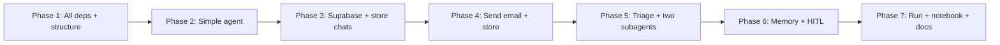
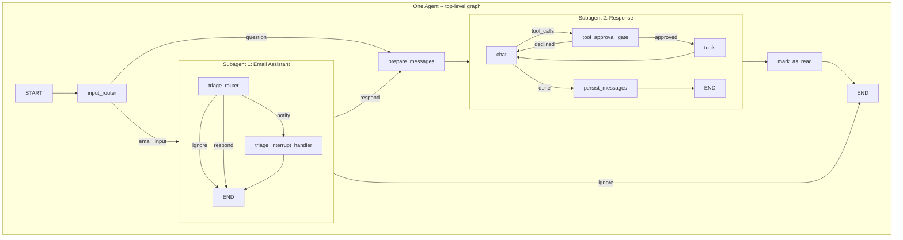
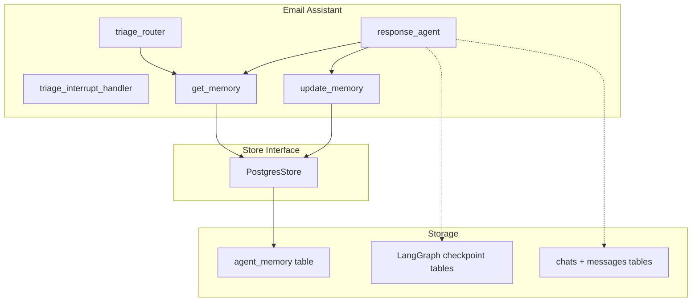

# Email Agent: Phased Implementation Plan

This plan splits the work into **seven phases** so you can build incrementally and track errors at each step. **Phase 1** installs **all** project dependencies and creates the **full** project structure. Phases 2-7 add features in order without adding new dependencies. Each phase section below contains the **full reference material** from the original design needed for that phase.


```mermaid
flowchart LR
  P1["Phase 1: All deps + structure"]
  P2["Phase 2: Simple agent"]
  P3["Phase 3: Supabase + store chats"]
  P4["Phase 4: Send email + store"]
  P5["Phase 5: Triage + two subagents"]
  P6["Phase 6: Memory + HITL"]
  P7["Phase 7: Run + notebook + docs"]
  P1 --> P2 --> P3 --> P4 --> P5 --> P6 --> P7
```


---

## Shared context: What we're building

The agent is built with **LangGraph** and **connected to LangSmith** for tracing. It is a human-in-the-loop (HITL), memory-enabled assistant that (1) **processes emails** (triage, notify, respond with review) and (2) **answers general user questions** when the user asks something directly.

### Dual input mode

- **Email mode**: Input is an email payload (`email_input`). Flow is triage -> ignore / notify / respond.
- **Question mode**: Input is a free-form user question (e.g. "What's on my calendar tomorrow?"). The agent responds directly -- no triage.
- **Send new email on request**: The user can ask the agent to **send a new message to a specific Gmail address** (e.g. "Send an email to [john@gmail.com](mailto:john@gmail.com) saying ..."). The agent can compose and send a **new** email, not only reply to incoming ones, in both question mode and respond path.

### Architecture: One agent, two subagents

The agent is a **single compiled graph** (one entry point) with **two subagents** (compiled subgraphs added as nodes):

1. **Email Assistant subagent** -- triage (ignore / notify / respond) and HITL (`interrupt()` for notify). When it exits, the parent reads `classification_decision` and `_notify_choice` from state and routes to prepare_messages (respond) or END (ignore).
2. **Response subagent** -- chat -> tool_approval_gate -> tools -> chat (tool loop), then persist_messages. Handles both question mode and the respond path after triage. Phase 6 adds a tool-approval HITL gate before running send_email or schedule_meeting.

Both subgraphs use the same `State` type (not `MessagesState`) so state flows through without manual mapping.

### High-level flow (email + question)


```mermaid
flowchart TB
    subgraph agent [One Agent -- top-level graph]
        startNode[START] --> input_router
        input_router -->|email_input| email_assistant_sub
        input_router -->|question| prepare_messages
        email_assistant_sub -->|respond| prepare_messages
        email_assistant_sub -->|ignore| endNode[END]
        prepare_messages --> response_sub
        response_sub --> mark_as_read
        mark_as_read --> endNode
    end
    subgraph email_assistant_sub [Subagent 1: Email Assistant]
        triage_router -->|ignore| eEnd[END]
        triage_router -->|notify| triage_interrupt_handler
        triage_router -->|respond| eEnd
        triage_interrupt_handler --> eEnd
    end
    subgraph response_sub [Subagent 2: Response]
        chat -->|tool_calls| tool_approval_gate
        tool_approval_gate -->|approved| tools
        tool_approval_gate -->|declined| chat
        chat -->|done| persist_messages
        tools --> chat
        persist_messages --> rEnd[END]
    end
```


**Key design decisions (from single_graph_two_subagents plan):**

- **State includes `user_message` and `question`** -- not just `StateInput`. `input_router` reads these fields; if they only lived in `StateInput`, LangGraph would silently drop them before the node sees them.
- **Both subgraphs use `State`** (not `MessagesState`) so the parent can pass full state through without manual mapping. The Response subgraph nodes only read/write `messages`, so they work with `State` unchanged.
- **Email Assistant subgraph must be a compiled subgraph node** (not a wrapper function). `interrupt()` in `triage_interrupt_handler` propagates correctly to the parent only when the subgraph is added as a compiled graph via `builder.add_node("email_assistant", compiled_subgraph)`.
- **`triage_interrupt_handler`** always exits to subgraph END. Both respond and ignore outcomes write to state (`_notify_choice`), then the subgraph ends. The parent reads `classification_decision` and `_notify_choice` and routes.
- **`prepare_messages`** is a thin node between triage and response that injects reply context (HumanMessage with email headers and body) when `email_id` and `email_input` are set.
- **One Studio entry** in `langgraph.json`: `email_assistant`. Question mode is just invoking without `email_input`.
- **Single routing function after Email Assistant subgraph:** `_after_email_assistant_route(state)` -- if `classification_decision == "respond"` OR `_notify_choice == "respond"` -> `prepare_messages`, else -> END.

**Response agent** does three things: **(1)** reply to an incoming email (respond path), **(2)** send a **new** email to a specified Gmail address when the user asks (question path or respond path), **(3)** answer questions and use other tools (calendar, fetch_emails, etc.).

- **input_router**: Inspects the request. If `email_input` is present and non-empty -> **email** path (triage). If a **user question** is present (`user_message` or `question` and no email) -> **question** path: go straight to **prepare_messages** -> **response_agent** with the question as the initial user message (no triage).
- **Question path**: `messages = [HumanMessage(content=user_question)]`; response_agent runs the same LLM + tools loop (answer, check_calendar, send_email if needed, Question, Done). `mark_as_read_node` is a no-op when there is no `email_id`.

### Email flow

- **Triage**: One LLM call classifies each email as **ignore** / **notify** / **respond** using `RouterSchema` (reasoning + classification).
- **Notify path**: `interrupt()` pauses the graph; user chooses respond (with optional feedback) or ignore via `Command(resume="respond")` or `Command(resume="ignore")`. Alternatively, an LLM auto-decision can replace the interrupt (see Phase 5 auto-decide option).
- **Respond path**: Response subgraph runs an LLM loop with tools; Phase 6 adds a tool-approval HITL gate; **Done** triggers mark-as-read and exit.

### State and nodes

- **State**: Extends `MessagesState` with `email_input` (dict or None), `user_message` / `question` (str, for question mode), `classification_decision` (ignore | notify | respond), `email_id` (str), `_notify_choice` (str), and `_tool_approval` (bool, Phase 6).
- **StateInput**: Accept either `email_input` (for email mode) or `user_message` / `question` (for question mode). Entry node decides which path to take. Used as `StateGraph(State, input_schema=StateInput)`.
- **Nodes**: `input_router`, `triage_router`, `triage_interrupt_handler`, `tool_approval_gate` (Phase 6), `prepare_messages`, `mark_as_read_node`. Response subgraph has `chat`, `tool_approval_gate`, `tools` (ToolNode), `persist_messages`.
- **HITL**: Nodes that need human-in-the-loop call `interrupt(...)` (from `langgraph.types`); the graph pauses and the caller resumes by invoking again with `Command(resume=...)`.
- **Memory**: Three namespaces under `("user_preferences", user_id)` -- `triage_preferences`, `response_preferences`, `cal_preferences`. Used for both email and question flows so the agent's style and preferences stay consistent.

### External integrations

- **LangGraph**: State graph (top-level + two compiled subgraphs as nodes); nodes, conditional edges, interrupts, store, checkpointer.
- **LangSmith**: Tracing, debugging, monitoring. Runs are sent when env vars are set; no extra package.
- **OpenAI**: Router LLM and response agent LLM (and memory-update LLM); structured outputs (`RouterSchema`, `UserPreferences`).
- **Gmail**: `send_email_tool` (reply + new email), `mark_as_read`, `fetch_emails_tool` for ingestion.
- **Google Calendar**: `check_calendar_tool`, `schedule_meeting_tool` -- for both email scheduling and questions.
- **Storage**: LangGraph **checkpointer** (for HITL/resume) and LangGraph **store** (for memory). Supabase/Postgres for app tables and the checkpointer.

### Configuration summary

- **LangGraph** (framework): State graph, nodes, interrupts, store
- **LangSmith** (`LANGCHAIN_TRACING_V2`, `LANGCHAIN_API_KEY`, optional `LANGCHAIN_PROJECT`): Tracing, debugging, monitoring
- **OpenAI** (`OPENAI_API_KEY`, optional `OPENAI_MODEL`): Router, response agent, memory-update LLMs
- **Gmail** (`GOOGLE_TOKEN_PATH` / `.secrets/token.json`): send_email, mark_as_read, fetch_emails
- **Calendar** (same Google OAuth scopes): check_calendar, schedule_meeting
- **Memory** (Postgres for `PostgresStore`): `get_memory` / `update_memory`; `agent_memory` table
- **Checkpointing** (`DATABASE_URL`, direct Postgres connection string): LangGraph `PostgresSaver`, own tables in `email_assistant` schema

**References:** [LangGraph overview](https://docs.langchain.com/oss/python/langgraph/overview), [Graph API](https://docs.langchain.com/oss/python/langgraph/graph-api), [Interrupts](https://docs.langchain.com/oss/python/langgraph/interrupts), [Add memory](https://docs.langchain.com/oss/python/langgraph/add-memory), [Durable execution](https://docs.langchain.com/oss/python/langgraph/durable-execution).

---

## Phase 1: All dependencies and full project structure

**Goal:** Install **all** project dependencies in one go and create the **full** project structure (every directory and placeholder file). No feature code yet. After this phase the repo is ready for any later phase without adding new packages.

### Project setup (uv, venv, requirements)

- **uv**: Use [uv](https://docs.astral.sh/uv/) to create the virtual environment and install dependencies.
- **Virtual environment**: Create and use a venv in the project root (`.venv`). Commands:
  - `uv venv` -- create `.venv`
  - `uv sync` -- install dependencies from `pyproject.toml` into the active venv
  - Activate: `source .venv/bin/activate` (Unix) or `.venv\Scripts\activate` (Windows).
- **Agent requirements** (in `pyproject.toml`; **all** in Phase 1, no staggered adds):
  - **LangGraph / LangChain**: `langgraph`, `langchain-openai`, `langchain-core`, `langchain-community` (if needed)
  - **LangSmith**: tracing works when `LANGCHAIN_TRACING_V2` and `LANGCHAIN_API_KEY` are set; no extra package
  - **OpenAI**: `openai` (often pulled in by `langchain-openai`)
  - **Supabase / Postgres**: `supabase`; for Postgres checkpointer/store use `psycopg[binary,pool]`
  - **Gmail / Google APIs**: `google-auth`, `google-auth-oauthlib`, `google-auth-httplib2`, `google-api-python-client`
  - **Checkpointer**: `langgraph-checkpoint-postgres` for `PostgresSaver`
  - **Utils**: `python-dotenv` for `.env` loading

Example `pyproject.toml`:

```toml
[project]
name = "email-assistant"
version = "0.1.0"
requires-python = ">=3.11"
dependencies = [
  "langgraph>=0.2",
  "langgraph-checkpoint-postgres",
  "langchain-openai",
  "langchain-core",
  "supabase",
  "psycopg[binary,pool]",
  "google-api-python-client",
  "google-auth-oauthlib",
  "google-auth-httplib2",
  "python-dotenv",
]
```

### File structure (full tree -- create all as placeholders)

```
email_assist_draft/
├── docs/
│   ├── email-assistant-gmail/          # (existing) design docs
│   ├── guide/                          # (Phase 7) 10-file structured guide
│   ├── code-explanations/              # (Phase 7) file-by-file code explanations
│   ├── PROJECT_OVERVIEW.md
│   ├── PROJECT_SUMMARY.md
│   ├── ARCHITECTURE.md
│   ├── CONFIGURATION.md
│   ├── DATABASE.md
│   ├── FILES_AND_MODULES.md
│   ├── PROMPTS.md
│   ├── RUNNING_AND_TESTING.md
│   └── GLOSSARY.md
├── src/
│   └── email_assistant/
│       ├── __init__.py
│       ├── email_assistant_hitl_memory_gmail.py   # Entry: build + compile graph (one agent, two subagents)
│       ├── simple_agent.py             # Response subgraph builder (build_response_subgraph)
│       ├── schemas.py                  # State, StateInput, RouterSchema, NotifyChoiceSchema
│       ├── prompts.py                  # Triage, agent, memory-update prompts; default_*
│       ├── utils.py                    # parse_gmail, format_gmail_markdown, format_for_display
│       ├── memory.py                   # get_memory, update_memory (store-agnostic)
│       ├── fixtures/
│       │   ├── __init__.py
│       │   └── mock_emails.py          # MOCK_EMAIL_NOTIFY/RESPOND/IGNORE; get_mock_email()
│       ├── nodes/
│       │   ├── __init__.py
│       │   ├── input_router.py         # input_router: email vs question
│       │   ├── triage.py               # triage_router (LLM + RouterSchema)
│       │   ├── triage_interrupt.py     # triage_interrupt_handler (interrupt or auto-decide)
│       │   ├── tool_approval.py        # tool_approval_gate: HITL before send_email/schedule_meeting (Phase 6)
│       │   ├── prepare_messages.py     # Inject reply context before Response subgraph
│       │   └── mark_as_read.py         # mark_as_read_node (no-op when no email_id)
│       ├── tools/
│       │   ├── __init__.py             # get_tools(include_gmail=..., include_calendar=...)
│       │   ├── gmail/
│       │   │   ├── __init__.py
│       │   │   ├── auth.py             # OAuth: get_credentials(), get_gmail_service()
│       │   │   ├── prompt_templates.py # get_gmail_tools_prompt(), GMAIL_TOOLS_PROMPT
│       │   │   ├── send_email.py       # send_email_tool (new + reply)
│       │   │   ├── fetch_emails.py     # fetch_emails_tool, fetch_recent_inbox, list_inbox_message_ids
│       │   │   ├── mark_as_read.py     # mark_as_read(email_id)
│       │   │   └── calendar.py         # check_calendar_tool, schedule_meeting_tool
│       │   └── common.py              # question_tool, done_tool
│       └── db/
│           ├── __init__.py
│           ├── store.py                # PostgresStore (search_path=email_assistant)
│           ├── checkpointer.py         # postgres_checkpointer() sync (search_path=email_assistant)
│           ├── studio_checkpointer.py  # generate_checkpointer() async for LangGraph Studio
│           └── persist_messages.py     # persist_messages() to chats/messages tables
├── scripts/
│   ├── run_agent.py                    # Run agent (question + email mode)
│   ├── run_mock_email.py              # Run graph with mock email fixtures
│   ├── simulate_gmail_email.py        # Simulate real Gmail delivery flow
│   ├── watch_gmail.py                 # Gmail watcher: poll INBOX, invoke graph per new email
│   ├── setup_db.py                    # One-time: checkpointer.setup(), store.setup(), migrations
│   ├── debug_triage.py                # Debug triage classification locally
│   └── test_gmail_read.py            # Test Gmail read access
├── migrations/
│   ├── 000_drop_email_assistant_schema.sql   # (dev only) drop and recreate schema
│   ├── 001_email_assistant_tables.sql        # App tables: users, chats, messages, agent_memory
│   └── 002_checkpoint_created_at.sql         # Add created_at to checkpoint tables
├── notebooks/
│   └── run_agent_sdk.ipynb            # (Phase 7) Run agent via SDK, HITL demo
├── tests/
├── .env.example
├── .secrets/                          # token.json, credentials.json (git-ignored)
├── .venv/
├── langgraph.json                     # LangGraph Studio: graphs, env, checkpointer.path
├── pyproject.toml
└── README.md
```

- **Entry point**: `src/email_assistant/email_assistant_hitl_memory_gmail.py` -- builds the top-level graph (START -> input_router -> email path or question path) with two compiled subgraphs as nodes, compiles with checkpointer and optional store.
- **Response subgraph**: `src/email_assistant/simple_agent.py` -- `build_response_subgraph(checkpointer, store)`. Phase 6 adds `tool_approval_gate` node inside this subgraph.
- **Memory**: `src/email_assistant/memory.py` -- `get_memory(store, user_id, namespace)` / `update_memory(store, user_id, namespace, value)`. Nodes receive store via closure when the graph is compiled with `store=...`.
- **DB layer**: `db/store.py` (PostgresStore with `search_path=email_assistant`), `db/checkpointer.py` (sync `PostgresSaver`), `db/studio_checkpointer.py` (async `AsyncPostgresSaver` for Studio), `db/persist_messages.py` (write to chats/messages tables).

### .env.example

```
# OpenAI
OPENAI_API_KEY=
OPENAI_MODEL=gpt-4o

# LangSmith
LANGCHAIN_TRACING_V2=true
LANGCHAIN_API_KEY=
LANGCHAIN_PROJECT=email-assistant

# Google / Gmail / Calendar
GOOGLE_TOKEN_PATH=.secrets/token.json
GOOGLE_CREDENTIALS_PATH=.secrets/credentials.json

# Supabase
SUPABASE_URL=
SUPABASE_KEY=

# Postgres (checkpointer + store)
DATABASE_URL=
```

### langgraph.json

```json
{
  "dependencies": ["."],
  "graphs": {
    "email_assistant": "./src/email_assistant/email_assistant_hitl_memory_gmail.py:email_assistant"
  },
  "env": ".env",
  "checkpointer": {
    "path": "./src/email_assistant/db/studio_checkpointer.py:generate_checkpointer"
  }
}
```

One graph entry (`email_assistant`). Studio uses the async checkpointer from `studio_checkpointer.py` so it shares the same Supabase Postgres in the `email_assistant` schema as CLI scripts.

### Phase 1 deliverable

From repo root: `uv venv`, activate venv, `uv sync`. Full directory tree and **all** placeholder files exist. All imports resolve. No feature code yet.

### Phase 1 checklist

- `pyproject.toml` has **all** dependencies above (not minimal)
- `.env.example` documents all env vars
- `langgraph.json` with one graph entry and checkpointer.path
- All directories and `__init__.py` in place per the tree above
- All module files exist as stubs (no real logic)
- All script files in `scripts/` exist as stubs
- `migrations/` dir with placeholder SQL files
- `README.md` with project name and how to run `uv sync`
- `uv sync` succeeds; venv activates; no import errors

---

## Phase 2: Simple agent (user message -> response)

**Goal:** Build a **minimal agent** that accepts a **user message** and **returns a response**. No Supabase, no database, no email sending. Use only LangGraph, OpenAI, and optional LangSmith. Validate that the stack works end-to-end.

### What to build

- **State:** Use LangGraph `MessagesState` only (messages list with `add_messages` reducer).
- **Graph:** Single node: call ChatOpenAI with `state["messages"]`, append response to messages. Edges: START -> node -> END.
- **Checkpointer:** Use `MemorySaver()` so you can pass `config={"configurable": {"thread_id": "..."}}` and get multi-turn in memory.
- **Entry point:** `src/email_assistant/simple_agent.py` that builds this graph and exposes `graph = builder.compile(checkpointer=MemorySaver())`.
- **Run:** Small script or notebook: invoke with `{"messages": [HumanMessage(content="Hello")]}` and same `thread_id`; print last message.

### OpenAI reference

- Response node calls `ChatOpenAI` (from `langchain-openai`). Later phases add structured outputs (`RouterSchema`) and `bind_tools`.
- Config: Use `OPENAI_API_KEY`; model choice (e.g. `gpt-4o`) in env or config.
- All LLM calls go through LangChain's `ChatOpenAI`.

### LangSmith reference

- LangChain/LangGraph automatically send traces to LangSmith when `LANGCHAIN_TRACING_V2=true` and `LANGCHAIN_API_KEY` are set.
- No extra package needed. Invoke the compiled graph as usual; runs appear in the LangSmith dashboard.

### Phase 2 deliverable

You can send a user message and receive an LLM response. Multi-turn works via MemorySaver and thread_id. No DB, no store, no email code.

### Phase 2 checklist

- One node that takes user text and returns assistant text
- Invocation works with `OPENAI_API_KEY` (and optional LangSmith tracing)
- Multi-turn works in same thread_id
- No DB, no store, no email code

---

## Phase 3: Supabase tables and store simple agent chats

**Goal:** Create **all application tables** in Supabase/Postgres, implement the **store** and **checkpointer** (in the `email_assistant` schema), and **persist the simple agent's messages** to Supabase. Agent behavior unchanged (question -> response); conversations are now stored.

### Supabase vs checkpointer -- roles

- **Memory (user preferences)** and **app tables** (users, chats, messages, agent_memory): Use Supabase (or your own Postgres) for application data. The store backs the three namespaces (`triage_preferences`, `response_preferences`, `cal_preferences`) and can be implemented with `PostgresStore`.
- **Checkpointing**: The **checkpointer is separate** from Supabase. It connects to **Postgres via a direct connection string** (`DATABASE_URL`) and stores graph state in **LangGraph's own tables**, created by `checkpointer.setup()`. It does not use the Supabase client or REST API.

### Memory store (Supabase/Postgres)

- **Interface**: Use `PostgresStore` from `langgraph.store.postgres` with `store.setup()` on first use.
- **Scoping (cross-chat)**: User preferences are **per user, not per chat** (`chat_id = NULL` in `agent_memory`). They persist across all conversations. The store keys on `("user_preferences", user_id)` with namespace key = `triage_preferences` / `response_preferences` / `cal_preferences`.
- **Usage**: In `email_assistant_hitl_memory_gmail.py`, create the store from config, pass it into `compile(..., store=...)`. Nodes receive store via closure (e.g. `_make_chat_node(store)`, `_make_triage_node(store)`).

### Checkpointer in `email_assistant` schema

The checkpointer stores its tables in the `email_assistant` schema (not `public`). This keeps all project data together.

**CLI checkpointer (sync) -- `db/checkpointer.py`:**

- Open a raw `psycopg.Connection` with `autocommit=True, prepare_threshold=None, row_factory=dict_row`.
- Execute `SET search_path TO email_assistant` on the connection.
- Yield `PostgresSaver(conn)` from a context manager; close the connection on exit.
- Do NOT use `PostgresSaver.from_conn_string()` -- it does not support `search_path`.

**Studio checkpointer (async) -- `db/studio_checkpointer.py`:**

LangGraph Studio (`langgraph dev`) requires an **async** checkpointer. Add a `"checkpointer"` key to `langgraph.json` pointing to an async context manager.

```python
import contextlib, os
from psycopg import AsyncConnection
from psycopg.rows import dict_row
from langgraph.checkpoint.postgres.aio import AsyncPostgresSaver

@contextlib.asynccontextmanager
async def generate_checkpointer():
    url = os.getenv("DATABASE_URL")
    conn = await AsyncConnection.connect(
        url, autocommit=True, prepare_threshold=0, row_factory=dict_row
    )
    try:
        await conn.execute("SET search_path TO email_assistant")
        saver = AsyncPostgresSaver(conn)
        await saver.setup()
        yield saver
    finally:
        await conn.close()
```

Now CLI scripts **and** Studio use the same Supabase Postgres in the `email_assistant` schema.

**How checkpointer storage works:** `checkpointer.setup()` runs migrations that create: `checkpoint_migrations`, `checkpoints`, `checkpoint_blobs`, `checkpoint_writes`. You do not create these tables yourself.

### Database schema (SQL)

**`migrations/001_email_assistant_tables.sql`:**

```sql
CREATE SCHEMA IF NOT EXISTS email_assistant;

CREATE TABLE IF NOT EXISTS email_assistant.users (
  user_id         UUID PRIMARY KEY DEFAULT gen_random_uuid(),
  email           TEXT,
  created_at      TIMESTAMPTZ NOT NULL DEFAULT now(),
  updated_at      TIMESTAMPTZ NOT NULL DEFAULT now()
);

CREATE TABLE IF NOT EXISTS email_assistant.chats (
  chat_id         UUID PRIMARY KEY DEFAULT gen_random_uuid(),
  user_id         UUID NOT NULL REFERENCES email_assistant.users(user_id) ON DELETE CASCADE,
  title           TEXT,
  created_at      TIMESTAMPTZ NOT NULL DEFAULT now(),
  updated_at      TIMESTAMPTZ NOT NULL DEFAULT now()
);

CREATE INDEX IF NOT EXISTS idx_chats_user_id ON email_assistant.chats(user_id);

CREATE TABLE IF NOT EXISTS email_assistant.messages (
  message_id      UUID PRIMARY KEY DEFAULT gen_random_uuid(),
  chat_id         UUID NOT NULL REFERENCES email_assistant.chats(chat_id) ON DELETE CASCADE,
  user_id         UUID NOT NULL REFERENCES email_assistant.users(user_id) ON DELETE CASCADE,
  role            TEXT NOT NULL CHECK (role IN ('user', 'assistant', 'system', 'tool')),
  content         TEXT,
  metadata        JSONB DEFAULT '{}',
  created_at      TIMESTAMPTZ NOT NULL DEFAULT now()
);

CREATE INDEX IF NOT EXISTS idx_messages_chat_id ON email_assistant.messages(chat_id);
CREATE INDEX IF NOT EXISTS idx_messages_user_id ON email_assistant.messages(user_id);
CREATE INDEX IF NOT EXISTS idx_messages_created_at ON email_assistant.messages(chat_id, created_at);

ALTER TABLE email_assistant.messages
  ADD COLUMN IF NOT EXISTS email_id TEXT;

CREATE TABLE IF NOT EXISTS email_assistant.agent_memory (
  id              BIGSERIAL PRIMARY KEY,
  user_id         UUID NOT NULL REFERENCES email_assistant.users(user_id) ON DELETE CASCADE,
  chat_id         UUID REFERENCES email_assistant.chats(chat_id) ON DELETE CASCADE,
  namespace       TEXT NOT NULL,
  key             TEXT NOT NULL DEFAULT 'user_preferences',
  value           TEXT,
  updated_at      TIMESTAMPTZ NOT NULL DEFAULT now(),
  UNIQUE (user_id, chat_id, namespace, key)
);

CREATE INDEX IF NOT EXISTS idx_agent_memory_user_chat ON email_assistant.agent_memory(user_id, chat_id);
CREATE INDEX IF NOT EXISTS idx_agent_memory_namespace ON email_assistant.agent_memory(user_id, namespace);
```

**`migrations/002_checkpoint_created_at.sql`** -- adds `created_at` timestamps to checkpoint tables:

```sql
ALTER TABLE checkpoint_migrations ADD COLUMN IF NOT EXISTS created_at TIMESTAMPTZ NOT NULL DEFAULT now();
ALTER TABLE checkpoints           ADD COLUMN IF NOT EXISTS created_at TIMESTAMPTZ NOT NULL DEFAULT now();
ALTER TABLE checkpoint_blobs      ADD COLUMN IF NOT EXISTS created_at TIMESTAMPTZ NOT NULL DEFAULT now();
ALTER TABLE checkpoint_writes     ADD COLUMN IF NOT EXISTS created_at TIMESTAMPTZ NOT NULL DEFAULT now();
```

Safe because the library's INSERT/SELECT use explicit column lists and never mention `created_at`.

### Persist messages -- `db/persist_messages.py`

After each graph run, persist `state["messages"]` to the `chats` and `messages` tables. The `_persist_messages_node` in the Response subgraph calls `persist_messages(conn_string, thread_id, user_id, messages)` to write rows. This gives queryable chat history independent of checkpoints.

### Setup script -- `scripts/setup_db.py`

One-time script: runs `checkpointer.setup()`, executes `002_checkpoint_created_at.sql`, and calls `store.setup()`.

### Data flow (memory + checkpointing)


```mermaid
flowchart TB
  subgraph app [Email Assistant]
    triage_router
    triage_interrupt_handler
    response_agent
    memory_get[get_memory]
    memory_update[update_memory]
  end
  subgraph store_interface [Store Interface]
    PostgresStore_node[PostgresStore]
  end
  subgraph db [Storage]
    agent_memory["agent_memory table"]
    checkpoints["LangGraph checkpoint tables"]
    messages_table["chats + messages tables"]
  end
  triage_router --> memory_get
  response_agent --> memory_get
  response_agent --> memory_update
  memory_get --> PostgresStore_node
  memory_update --> PostgresStore_node
  PostgresStore_node --> agent_memory
  response_agent -.-> checkpoints
  response_agent -.-> messages_table
```


### Phase 3 deliverable

Migrations run. Tables exist. `db/store.py`, `db/checkpointer.py`, `db/studio_checkpointer.py`, `db/persist_messages.py` implemented. `setup_db.py` runs setup. Messages persisted after each run. Agent behavior unchanged.

### Phase 3 checklist

- SQL migrations run; users, chats, messages, agent_memory tables exist in `email_assistant` schema
- CLI checkpointer uses `search_path = email_assistant`; `checkpointer.setup()` run
- Studio checkpointer (async) in `studio_checkpointer.py`; `langgraph.json` has `checkpointer.path`
- 002 migration adds `created_at` to checkpoint tables
- Store implemented (`PostgresStore`); `store.setup()` if needed
- `persist_messages.py` writes to chats/messages tables
- `setup_db.py` runs all setup steps
- Agent writes messages to Supabase messages table when it runs
- Config: `DATABASE_URL` in `.env`

---

## Phase 4: Send email from user message and store to Supabase

**Goal:** Add the ability for the user to ask the agent to **send an email** (e.g. "Send an email to [john@gmail.com](mailto:john@gmail.com) saying ..."). Implement **send_email_tool** (new email, no `email_id`). Continue storing all messages.

### Gmail reference

- Implement `send_email_tool`, `mark_as_read`, and optionally `fetch_emails_tool` using Gmail API (OAuth token from `GOOGLE_TOKEN_PATH` / `token.json`). Keep `parse_gmail` and `format_gmail_markdown` in `utils.py`.
- **First run**: Google OAuth flow opens a browser for consent and writes `token.json`.
- **send_email_tool -- two use cases**:
  - **Reply to an email**: Call with `email_id` (implemented in Phase 5).
  - **Send a new email**: Call without `email_id`, with `email_address` (recipient), subject, body.
- **Calendar tools** (optional for Phase 4): `check_calendar_tool` and `schedule_meeting_tool` with Google Calendar API. Calendar scopes added in `auth.py`.
- **fetch_emails_tool**: `@tool` that calls `fetch_recent_inbox()` and returns a short summary.

### OAuth scopes (`auth.py`)

```python
SCOPES = [
    "https://www.googleapis.com/auth/gmail.send",
    "https://www.googleapis.com/auth/gmail.readonly",
    "https://www.googleapis.com/auth/gmail.modify",
    "https://www.googleapis.com/auth/calendar",
    "https://www.googleapis.com/auth/calendar.events",
]
```

### Tools (`tools/__init__.py`)

```python
def get_tools(include_gmail=True, include_calendar=True):
    tools = [question_tool, done_tool]
    if include_gmail:
        tools.insert(0, send_email_tool)
        tools.append(fetch_emails_tool)
    if include_calendar:
        tools.extend([check_calendar_tool, schedule_meeting_tool])
    return tools
```

### What to build in Phase 4

- `send_email_tool` in `tools/gmail/send_email.py`: new email via Gmail API.
- `fetch_emails_tool` in `tools/gmail/fetch_emails.py`: list recent inbox.
- `check_calendar_tool` and `schedule_meeting_tool` in `tools/gmail/calendar.py`: Google Calendar API.
- Google OAuth setup (`token.json`).
- Expose tools to the LLM (`bind_tools` on ChatOpenAI).
- Extend the Phase 2 graph to a tool-call loop (chat -> tools -> chat -> persist).

### Phase 4 deliverable

User can send a message like "Email [sarah@company.com](mailto:sarah@company.com) with subject Hello." Agent uses send_email_tool (new email). Calendar tools available. All messages still stored.

### Phase 4 checklist

- `send_email_tool` implemented; supports new email (no email_id)
- `fetch_emails_tool`, `check_calendar_tool`, `schedule_meeting_tool` implemented
- Gmail + Calendar OAuth and `token.json` working
- Agent has tools bound to LLM; system prompt instructs tool usage
- Tool-call loop: LLM calls tool -> tool runs -> result back to LLM
- Messages still persisted to Supabase

---

## Phase 5: Email triage and email mode (one agent, two subagents)

**Goal:** Add **email mode** and restructure into **one agent with two compiled subgraphs** (Email Assistant + Response). Implement `input_router`, `triage_router`, `triage_interrupt_handler`, `prepare_messages`, and conditional edges. Extend `send_email_tool` to support reply (`email_id`). Add `mark_as_read`. Add mock email testing infrastructure.

### Architecture: one agent, two compiled subgraphs as nodes

This is the **final architecture**. See "Shared context" section above for the full diagram.

**Why compiled subgraphs (not wrapper functions):**

- `interrupt()` in `triage_interrupt_handler` only propagates correctly when the subgraph is a compiled graph added via `builder.add_node(name, compiled_graph)`.
- LangGraph needs to see the compiled graph as a node to handle interrupt propagation.

**Build the Email Assistant subgraph:**

```python
def build_email_assistant_subgraph(store=None):
    builder = StateGraph(State)
    builder.add_node("triage_router", _make_triage_node(store))
    builder.add_node("triage_interrupt_handler", triage_interrupt_handler)
    builder.add_edge(START, "triage_router")
    builder.add_conditional_edges("triage_router", _after_triage_route, {
        "triage_interrupt_handler": "triage_interrupt_handler",
        "__end__": END,
    })
    builder.add_edge("triage_interrupt_handler", END)  # always exits to END
    return builder.compile()
```

**Wire the top-level graph:**

```python
def build_email_assistant_graph(checkpointer=None, store=None):
    email_subgraph = build_email_assistant_subgraph(store=store)
    response_subgraph = build_response_subgraph(store=store)
    builder = StateGraph(State, input_schema=StateInput)
    builder.add_node("input_router", input_router)
    builder.add_node("email_assistant", email_subgraph)          # compiled subgraph as node
    builder.add_node("prepare_messages", prepare_messages)
    builder.add_node("response_agent", response_subgraph)        # compiled subgraph as node
    builder.add_node("mark_as_read", mark_as_read_node)
    builder.add_edge(START, "input_router")
    builder.add_conditional_edges("input_router", _after_input_router_route, ...)
    builder.add_conditional_edges("email_assistant", _after_email_assistant_route, ...)
    builder.add_edge("prepare_messages", "response_agent")
    builder.add_edge("response_agent", "mark_as_read")
    builder.add_edge("mark_as_read", END)
    ...
```

**Routing functions:**

- `_after_input_router_route(state)`: if `email_input` -> `"email_assistant"`, else -> `"prepare_messages"`.
- `_after_email_assistant_route(state)`: if `classification_decision == "respond"` OR `_notify_choice == "respond"` -> `"prepare_messages"`, else -> END.

### State (schemas.py)

```python
State = TypedDict("State", {
    "messages": Annotated[list, add_messages],
    "email_input": Optional[dict],
    "classification_decision": Optional[ClassificationDecision],
    "email_id": Optional[str],
    "_notify_choice": Optional[str],
    "_tool_approval": Optional[bool],      # Phase 6
    "user_message": Optional[str],
    "question": Optional[str],
})
```

### Triage prompts (full prompt design)

All prompts in `prompts.py` and `tools/gmail/prompt_templates.py` should be **as strong as possible**: clear role and task, explicit constraints, minimal ambiguity, and guardrails.

**General principles:**

- **Role and identity**: Start with a concrete role. Include the user's **background** so the model can tailor triage and replies.
- **Task in one place**: State the exact task in one short paragraph.
- **Output format and schema**: Tie prompts to structured output (`RouterSchema`). Restate required fields and allowed values.
- **Constraints and prohibitions**: List what the model must not do.
- **Reasoning**: Ask for brief step-by-step reasoning ("reasoning" field).
- **Today's date**: Inject `"Today's date is YYYY-MM-DD."` so scheduling references are grounded.
- **Examples (few-shot)**: 1-2 short examples for edge cases.

**Triage prompts:**

- **System** (`get_triage_system_prompt`): Role, background, triage_instructions (from memory or default). Define **ignore** / **notify** / **respond** with crisp criteria and concrete examples.
- **User** (`get_triage_user_prompt`): From, To, Subject, Body in fixed markdown format. End with: "Classify into exactly one of: ignore, notify, respond."
- **Defaults** (`DEFAULT_TRIAGE_INSTRUCTIONS`): Detailed bullet lists -- "Ignore: marketing newsletters, automated receipts..." etc.

**Response agent prompt:**

- `get_agent_system_prompt_hitl_memory(response_preferences, cal_preferences)` -- Role, response_preferences and cal_preferences from memory, tools_prompt (GMAIL_TOOLS_PROMPT), rules, question mode instructions, prohibitions, today's date.

### Notify: HITL interrupt vs auto-decide

**Default (HITL interrupt):** `triage_interrupt_handler` calls `interrupt(NOTIFY_INTERRUPT_MESSAGE)`. Graph pauses; caller resumes with `Command(resume="respond")` or `Command(resume="ignore")`.

**Alternative (auto-decide, no HITL):** Replace `interrupt()` with an LLM call using `NotifyChoiceSchema` (`choice: Literal["respond", "ignore"]`) that decides based on the email content. Return `{"_notify_choice": result.choice}`. No graph pause. Use this when you want fully automatic triage with no human intervention on notify emails.

### Mock email testing infrastructure

- **`fixtures/mock_emails.py`**: `MOCK_EMAIL_NOTIFY`, `MOCK_EMAIL_RESPOND`, `MOCK_EMAIL_IGNORE` dicts; `get_mock_email(name)`.
- **`scripts/run_mock_email.py`**: Run graph with mock email; on notify interrupt prompts (r)espond or (i)gnore and resumes.
- **`scripts/simulate_gmail_email.py`**: Same flow as real Gmail delivery; mock payload with same shape.
- **`scripts/watch_gmail.py`**: Poll INBOX, invoke graph per new email; processed ids in `.gmail_processed_ids.json`.
- **`scripts/debug_triage.py`**: Debug triage classification locally -- prints raw input, normalized email_input, `_is_explicit_request` match, final classification.
- **`scripts/test_gmail_read.py`**: Test Gmail read access.

### Phase 5 deliverable

One agent with two compiled subgraphs: START -> input_router -> (email -> Email Assistant subgraph -> respond/ignore; question -> prepare_messages -> Response subgraph -> mark_as_read). Triage uses RouterSchema. Notify has interrupt (or auto-decide). send_email_tool supports reply. Mock testing scripts work.

### Phase 5 checklist

- `schemas.py`: State with email_input, classification_decision, _notify_choice, user_message, question; StateInput; RouterSchema; NotifyChoiceSchema
- `prompts.py`: triage_system_prompt, triage_user_prompt, DEFAULT_TRIAGE_INSTRUCTIONS; get_agent_system_prompt_hitl_memory
- `tools/gmail/prompt_templates.py`: GMAIL_TOOLS_PROMPT (all tools described)
- `nodes/input_router.py`: routes email_input -> triage, user_message -> prepare_messages
- `nodes/triage.py`: LLM + RouterSchema structured output; optional triage_instructions from memory
- `nodes/triage_interrupt.py`: interrupt() for notify (or auto-decide alternative)
- `nodes/prepare_messages.py`: inject reply context when email_id/email_input set
- `nodes/mark_as_read.py`: no-op when no email_id
- `email_assistant_hitl_memory_gmail.py`: one agent, two compiled subgraphs, conditional edges, _after_email_assistant_route
- `simple_agent.py`: build_response_subgraph() with State (not MessagesState)
- `send_email_tool` supports email_id for reply
- `fixtures/mock_emails.py` and testing scripts (run_mock_email, simulate_gmail_email, watch_gmail, debug_triage)
- `langgraph.json`: one graph entry (`email_assistant`), checkpointer.path

---

## Phase 6: Memory (user preferences) and HITL polish

**Goal:** User preferences stored in the store and injected into prompts. HITL for send_email/schedule_meeting approval (tool-approval gate). Memory-update LLM after user feedback. Graph compiled with `store=...`.

### Memory in graph

- `memory.py`: `get_memory(store, user_id, namespace)` -> `store.get(("user_preferences", user_id), namespace)`. `update_memory(store, user_id, namespace, value)` -> `store.put(...)`.
- **Scoping**: Preferences are per user (`chat_id = NULL` in agent_memory). Namespaces: `triage_preferences`, `response_preferences`, `cal_preferences`.
- **Prompts**: Triage system prompt includes `triage_instructions` from `get_memory("triage_preferences")`. Response agent system prompt includes `response_preferences` and `cal_preferences`.
- Compile graph with `store=...` so nodes can access it via closure.

### Wiring memory into nodes

- **Triage**: `_make_triage_node(store)` -- factory that returns a node function; loads `triage_preferences` from store and calls `triage_router(state, triage_instructions=...)`.
- **Response agent**: `_make_chat_node(store)` -- factory that returns a node function; loads `response_preferences` and `cal_preferences` from store and uses `get_agent_system_prompt_hitl_memory()`.
- **Entry point**: `build_email_assistant_graph(checkpointer=..., store=...)` passes store to both subgraph builders. `compile(..., store=store)` when store is set.

### Tool-approval HITL gate (`nodes/tool_approval.py`)

Before running `send_email_tool` or `schedule_meeting_tool`, the graph pauses for human approval.

```python
TOOLS_REQUIRING_APPROVAL = ("send_email_tool", "schedule_meeting_tool")

def tool_approval_gate(state: State) -> dict:
    # If last message has tool_calls for send_email or schedule_meeting, interrupt.
    # On resume with True: set _tool_approval = True (proceed to tools).
    # On resume with False: inject "User declined" ToolMessages, set _tool_approval = False (go back to chat).
    ...
    choice = interrupt({
        "message": "Approve tool execution?",
        "tool_calls": [...],
    })
    if choice is True:
        return {"_tool_approval": True}
    # Inject declined ToolMessages
    return {"messages": declined_messages, "_tool_approval": False}
```

**Response subgraph flow with approval gate:**

```
START -> chat -> (tool_calls?) -> tool_approval_gate -> (approved?) -> tools -> chat
                                                     -> (declined?) -> chat
         chat -> (no tool_calls) -> persist_messages -> END
```

### Memory-update LLM and prompts

The memory-update LLM uses `llm.with_structured_output(UserPreferences)` to produce the updated profile.

**`MEMORY_UPDATE_SYSTEM` prompt:**

```
You update the user's preference profile based only on the provided feedback.
You do not invent or assume preferences.

Rules:
1. Output the full updated profile text (entire string to store), not a diff.
2. Change only what the feedback justifies; leave all other sentences unchanged.
3. Preserve tone and structure (bullets, sections).
4. Do not add generic advice; only add or correct specific, stated preferences.

Steps: (1) Read the current profile. (2) Read the feedback. (3) Identify which part
the feedback refers to. (4) Update only that part. (5) Output the complete new profile.
```

### HITL summary

Two interrupt points:

1. **Triage notify** (`triage_interrupt_handler`): responds with `"respond"` or `"ignore"`.
2. **Tool approval** (`tool_approval_gate`): responds with `True` (run) or `False` (decline).

Both use `interrupt()` from `langgraph.types`. The caller resumes with `Command(resume=<choice>)` (same `thread_id`).

### run_agent.py update

The interrupt loop in `run_agent.py` handles both interrupt types:

```python
while result.get("__interrupt__"):
    payload = result["__interrupt__"]
    if isinstance(payload, dict) and "tool_calls" in payload:
        # Tool approval
        raw = input("Approve? (y/n): ").strip().lower()
        choice = raw != "n"
    else:
        # Notify
        raw = input("(r)espond or (i)gnore? ").strip().lower()
        choice = "respond" if raw.startswith("r") else "ignore"
    result = graph.invoke(Command(resume=choice), config=config)
```

When `DATABASE_URL` is set, `run_agent.py` uses both `postgres_checkpointer()` and `postgres_store()`.

### Phase 6 deliverable

Full agent: question mode, email mode, triage, notify/respond, preferences in store (injected into prompts), HITL for notify and tool approval, memory-update LLM prompt, graph compiled with store.

### Phase 6 checklist

- `memory.py`: `get_memory` / `update_memory` fully implemented with store
- `_make_triage_node(store)` loads triage_preferences into triage prompt
- `_make_chat_node(store)` loads response/cal preferences into response agent prompt
- `MEMORY_UPDATE_SYSTEM` prompt in `prompts.py`
- `nodes/tool_approval.py`: `tool_approval_gate` with interrupt before send_email/schedule_meeting
- `_tool_approval` field in State; response subgraph routes through approval gate
- `interrupt()` in triage_interrupt_handler and tool_approval_gate
- Resume with `Command(resume=...)` documented and scripted
- Checkpointer and store in `compile()`; `thread_id` and `user_id` in config
- `run_agent.py` handles both notify and tool-approval interrupts

---

## Phase 7: Run script, notebook, and documentation

**Goal:** Easy ways to run the agent (script and notebook) and full post-implementation documentation so the project is self-documented.

### Run script

`scripts/run_agent.py` -- loads `.env`, builds graph with checkpointer/store, invokes with `email_input` or `user_message`, handles interrupts (notify + tool approval). When `DATABASE_URL` is set, uses Postgres checkpointer and store.

### Notebook (SDK)

`notebooks/run_agent_sdk.ipynb` -- loads the compiled agent from the project and runs it via `invoke()` and `stream()`.

**Notebook structure:**

1. **Setup**: Add repo root to `sys.path`; load `.env`.
2. **Imports**: Import compiled graph and `Command`.
3. **Config**: Set `thread_id` and `user_id`; build config.
4. **Run question mode**: Invoke with `user_message` only. Print last message.
5. **Run email mode**: Invoke with `email_input` (mock). Print classification.
6. **Handle HITL**: Loop on `result.get("__interrupt__")`. For notify: `"respond"` or `"ignore"`. For tool approval: `True` or `False`. Resume with `Command(resume=choice)`.
7. **Optional**: `graph.stream(...)` or `graph.get_state(config)`.

### Post-implementation documentation

**Where:** Under `docs/` at repo root. All files `.md` and version-controlled.

**Doc set:**

- **`docs/PROJECT_OVERVIEW.md`** (or `README.md`): What the project does, main features, tech stack, how to run in 3-5 steps.
- **`docs/PROJECT_SUMMARY.md`**: Summary of what was done from project start to now (phases, refactors, fixes).
- **`docs/ARCHITECTURE.md`**: High-level flow, graph structure (one agent, two subagents), state shape, data flow. Mermaid diagrams.
- **`docs/CONFIGURATION.md`**: Every env variable, what it's for, where to get it, optional vs required. `.env.example`.
- **`docs/DATABASE.md`**: Schema (users, chats, messages, agent_memory), store, checkpointer, migrations, setup.
- **`docs/FILES_AND_MODULES.md`**: File-by-file guide. Purpose, main functions, how it fits in the graph, key dependencies.
- **`docs/PROMPTS.md`**: Where prompts live, what each prompt is for, how they are parameterized.
- **`docs/RUNNING_AND_TESTING.md`**: How to run (script + notebook), email_input vs user_message, thread_id/user_id, mock testing, LangSmith tips.
- **`docs/GLOSSARY.md`**: Key terms (triage, notify, respond, HITL, thread_id, store, checkpointer, namespaces, etc.).

**Extended documentation (optional):**

- **`docs/guide/`**: 10-file structured guide (01_OVERVIEW through 10_QUICK_REFERENCE).
- **`docs/code-explanations/`**: File-by-file code explanations with line-by-line breakdowns.

### Phase 7 deliverable

`run_agent.py` runs both modes with HITL. Notebook runs with question mode, email mode, and HITL resume. All documentation files written and accurate.

### Phase 7 checklist

- `run_agent.py` loads `.env` and invokes graph for both modes; OAuth works; handles both interrupt types
- Notebook runs; question mode, email mode, and HITL resume demonstrated
- PROJECT_OVERVIEW, PROJECT_SUMMARY, ARCHITECTURE, CONFIGURATION, DATABASE, FILES_AND_MODULES, PROMPTS, RUNNING_AND_TESTING, GLOSSARY written
- Optional: guide/ and code-explanations/ directories

---

## Summary table

- **Phase 1** -- All dependencies + full project structure: venv, pyproject.toml (all deps), full tree (including fixtures, db modules, all scripts), langgraph.json, all imports resolve
- **Phase 2** -- Simple agent (user message -> response): No DB/email; LLM responds to user text; MemorySaver multi-turn
- **Phase 3** -- Tables + store + store messages in Supabase: Migration run; checkpointer in email_assistant schema (CLI + Studio); store; persist_messages; setup_db.py; 002 migration for created_at
- **Phase 4** -- Send email + calendar + store: send_email_tool (new email); fetch_emails_tool; check_calendar_tool; schedule_meeting_tool; Gmail + Calendar OAuth
- **Phase 5** -- Email triage + one agent, two subagents: email_input -> triage -> ignore/notify/respond; one compiled graph with two subgraphs; prepare_messages; reply; prompts; mock testing scripts; watch_gmail
- **Phase 6** -- Memory + HITL: Store-backed preferences; get_memory/update_memory wired into prompts; tool_approval_gate (interrupt before send/schedule); MEMORY_UPDATE_SYSTEM prompt; interrupt + Command(resume)
- **Phase 7** -- Run script + notebook + docs: run_agent.py (both modes + both interrupts), notebook, full documentation set (9 docs + optional guide/ and code-explanations/)

**Phases 2-7 do not add new dependencies;** they use the stack installed in Phase 1.