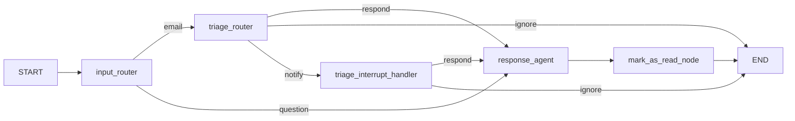
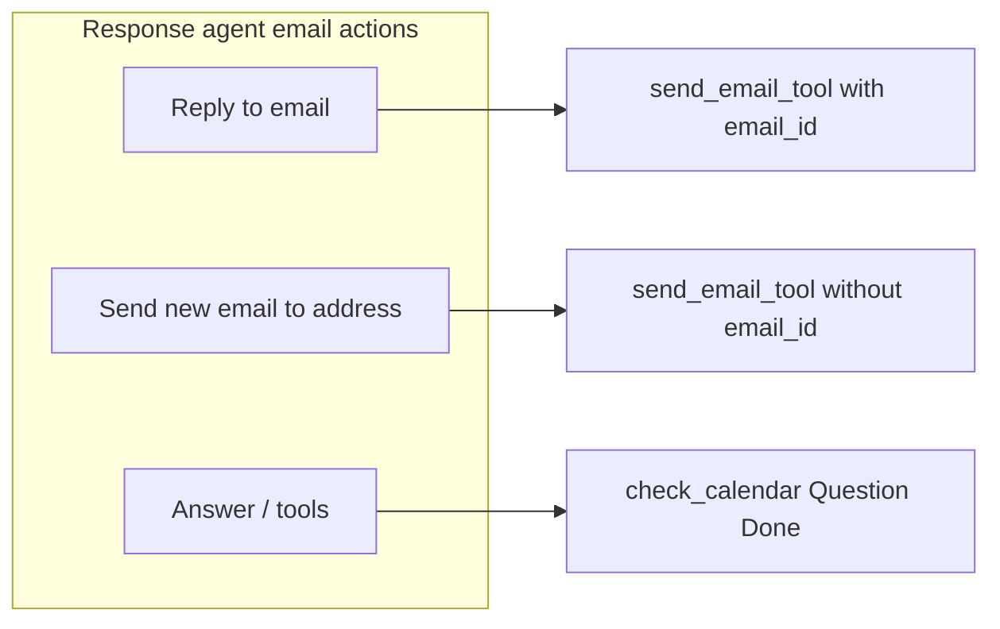
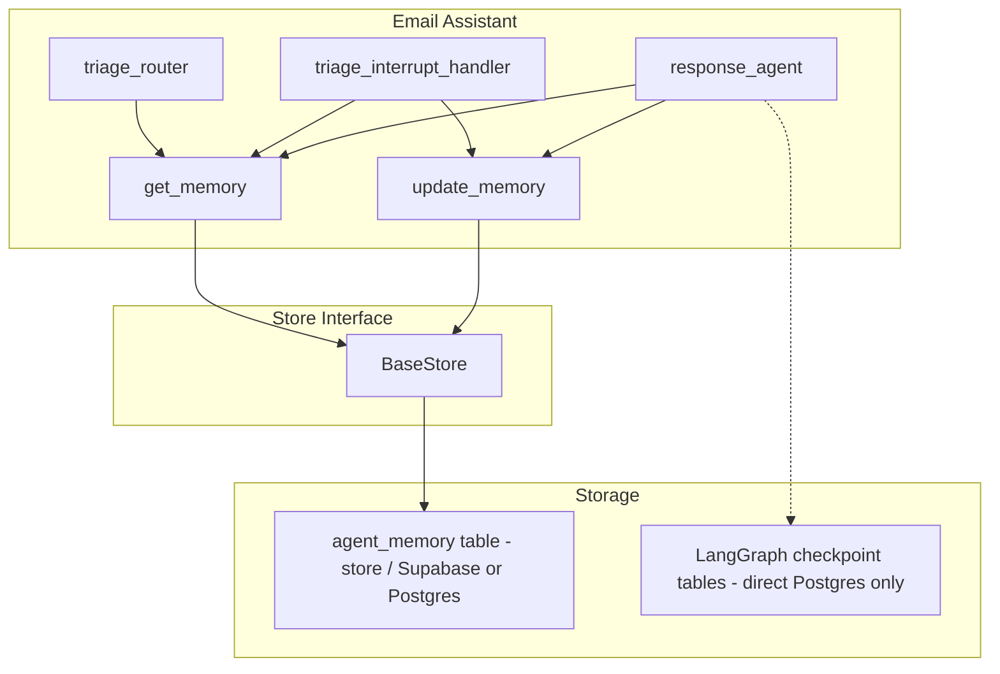

# Email Agent: Detailed Plan and File Structure

Based on [docs/email-assistant-gmail/](docs/email-assistant-gmail/), the agent is **built with LangGraph** and **connected to LangSmith** for tracing and observability. It is a human-in-the-loop (HITL), memory-enabled assistant that (1) **processes emails** (triage, notify, respond with review) and (2) **answers general user questions** when the user asks something directly. Below: agent summary (including question/chat mode), then file structure and integration design for **Supabase/PostgreSQL** (memory + checkpointing), **OpenAI**, **Gmail**, and **LangSmith**.

---

## Part 1: Agent Summary (Email + Question modes)

### Dual input mode

The agent supports two kinds of input:

- **Email mode**: Input is an email payload (`email_input`). Flow is triage → ignore / notify / respond as in the docs.
- **Question mode**: Input is a free-form user question (e.g. “What’s on my calendar tomorrow?”, “Summarize my last week’s emails”). The agent should **respond directly**—no triage; the same response capabilities (LLM + tools, optional HITL) are used to answer.
- **Send new email on request**: The user can ask the agent to **send a new message to a specific Gmail address** (e.g. “Send an email to [john@gmail.com](mailto:john@gmail.com) saying …” or “Email [sarah@company.com](mailto:sarah@company.com) with subject X and tell her …”). The agent is **not only replying to emails you received**—it can compose and send a **new** email to a recipient the user specifies, in both question mode and (when relevant) in the respond path.

So the agent is **not only for email triage/reply**: it answers questions and can **send new emails** to a given address when the user asks.

### High-level flow (email + question)




**Response agent** does three things (not only replying to incoming email): **(1)** reply to an incoming email (respond path), **(2)** send a **new** email to a specified Gmail address when the user asks (question path or respond path), **(3)** answer questions and use other tools (calendar, etc.). The diagram below shows how email-sending is used in both reply and new-email cases:




- **input_router** (new): Inspects the request. If `email_input` is present and non-empty → **email** path (triage). If a **user question** is present (e.g. `user_message` or `question` and no email) → **question** path: go straight to **response_agent** with the question as the initial user message (no triage, no mark_as_read unless the conversation was about an email).
- **Question path**: `messages = [HumanMessage(content=user_question)]`; response_agent runs the same LLM + tools loop (answer, check_calendar, send_email if needed, Question, Done). No `mark_as_read_node` for pure Q&A (or run it only when the last turn was about an email and had an `email_id`).

### Email flow (unchanged from docs)

- **Triage**: One LLM call classifies each email as **ignore** / **notify** / **respond** using `RouterSchema` (reasoning + classification).
- **Notify path**: Email shown in Agent Inbox; user chooses respond (with optional feedback) or ignore; choice updates **triage_preferences** memory.
- **Respond path**: Response subgraph runs an LLM loop with tools; HITL tools (send_email, schedule_meeting, Question) go to Agent Inbox; when user accepts/edits/ignores/responds, memory may be updated; **Done** triggers mark-as-read and exit.

### State and nodes

- **State**: Extends `MessagesState` with `email_input` (dict or None), optional `user_message` / `question` (str) for question mode, and `classification_decision` (ignore | notify | respond). Messages hold the conversation for the response agent.
- **StateInput**: Accept either `email_input` (for email mode) or `user_message` / `question` (for question mode). Entry node decides which path to take.
- **Nodes**: `input_router` (new; Command or conditional edge), `triage_router` (Command), `triage_interrupt_handler` (Command), `response_agent` (subgraph), `llm_call`, `interrupt_handler`, `mark_as_read_node`. For question mode, `mark_as_read_node` is a no-op when there is no `email_id`. **HITL**: Nodes that need human-in-the-loop call `interrupt(...)` (from `langgraph.types`); the graph pauses and the caller resumes by invoking again with `Command(resume=...)` or `Command(goto="node_name")`.
- **Memory**: Same three namespaces under key `"user_preferences"`—triage, response, cal. Used for both email and question flows so the agent’s style and preferences stay consistent.

### Question mode: behavior and prompt

- **Prompt**: Reuse the same response agent system prompt (background, response_preferences, cal_preferences, tools). For question mode, the initial user message is the question; the agent can use tools (e.g. check_calendar, fetch_emails, send_email) when relevant. Include in the system prompt: (1) “When the user asks a direct question (not an email), answer helpfully using your tools if needed.” (2) “When the user asks you to **send an email** to a specific address (e.g. ‘send a message to X’ or ‘email Y saying Z’), use send_email_tool to compose and send a **new** email to that recipient—you are not only replying to incoming emails.” For full prompt design (role, constraints, prohibitions, examples), see **Part 5.4**.
- **mark_as_read**: In question mode there is no `email_input`/`email_id`, so `mark_as_read_node` should no-op (or skip) when `email_id` is absent. No change to the node contract—already “if email_id present, mark as read.”

### External integrations (from docs)

- **LangGraph**: The agent is implemented as a LangGraph state graph (top-level + response subgraph); nodes, conditional edges, interrupts, and store/checkpointer are all LangGraph primitives.
- **LangSmith**: The agent is **connected to LangSmith** for tracing, debugging, and monitoring. Runs (graph execution, LLM calls, tool calls) are sent to LangSmith when env vars are set; use the LangSmith UI to inspect traces, latency, and errors.
- **OpenAI**: Router LLM and response agent LLM (and memory-update LLM); structured outputs (`RouterSchema`, `UserPreferences`).
- **Gmail**: `send_email_tool` (both **reply** to an existing email and **send new** email to a specified address when the user asks), `mark_as_read`; optional `fetch_emails_tool` for ingestion and for answering questions about email.
- **Google Calendar** (optional): `check_calendar_tool`, `schedule_meeting_tool`—used for both email scheduling and for questions like “What’s on my calendar?”
- **Storage**: Docs assume a LangGraph **checkpointer** (for HITL/resume) and a LangGraph **store** (for memory). No Supabase/Postgres in docs—your requirement adds these.

**References (current LangChain/LangGraph docs):** [LangGraph overview](https://docs.langchain.com/oss/python/langgraph/overview), [Graph API](https://docs.langchain.com/oss/python/langgraph/graph-api), [Interrupts](https://docs.langchain.com/oss/python/langgraph/interrupts), [Add memory](https://docs.langchain.com/oss/python/langgraph/add-memory), [Durable execution](https://docs.langchain.com/oss/python/langgraph/durable-execution).

---

## Part 2: Project setup (uv, virtual environment, requirements)

The project uses **uv** for package and environment management and a **virtual environment** for isolation. All agent dependencies are declared and installed via uv.

- **uv**: Use [uv](https://docs.astral.sh/uv/) to create the virtual environment and install dependencies (faster than pip, single tool for venv + lockfile).
- **Virtual environment**: Create and use a venv in the project root (e.g. `.venv`). Commands:
  - `uv venv` — create `.venv`
  - `uv sync` — install dependencies from `pyproject.toml` (and lockfile) into the active venv
  - Activate: `source .venv/bin/activate` (Unix) or `.venv\Scripts\activate` (Windows).
- **Agent requirements** (in `pyproject.toml` or `requirements.txt`): include at least:
  - **LangGraph / LangChain**: `langgraph`, `langchain-openai`, `langchain-core`, `langchain-community` (if needed)
  - **LangSmith**: tracing works when `LANGCHAIN_TRACING_V2` and `LANGCHAIN_API_KEY` are set; no extra package beyond LangChain
  - **OpenAI**: `openai` (often pulled in by `langchain-openai`)
  - **Supabase / Postgres**: `supabase`; for Postgres checkpointer/store use `**psycopg[binary,pool]`** (recommended in current LangGraph docs), or `psycopg2-binary` if the team is already standardized on it
  - **Gmail / Google APIs**: `google-auth`, `google-auth-oauthlib`, `google-auth-httplib2`, `google-api-python-client`
  - **Checkpointer**: `langgraph-checkpoint-postgres` for `PostgresSaver`
  - **Utils**: `python-dotenv` for `.env` loading

Example `pyproject.toml` slice (uv-style):

```toml
[project]
name = "email-assistant"
version = "0.1.0"
requires-python = ">=3.11"
dependencies = [
  "langgraph>=0.2",
  "langgraph-checkpoint-postgres",
  "langchain-openai",
  "langchain-core",
  "supabase",
  "psycopg[binary,pool]",
  "google-api-python-client",
  "google-auth-oauthlib",
  "google-auth-httplib2",
  "python-dotenv",
]
```

- **Workflow**: From repo root, run `uv venv`, activate the venv, run `uv sync` (or `uv pip install -r requirements.txt` if using requirements.txt). Then run the agent with this venv so all imports resolve.

---

## Part 3: File Structure

Proposed layout aligned with docs and with a clear place for Supabase/Postgres, OpenAI, and Gmail:

```
email_assist_draft/
├── docs/
│   ├── email-assistant-gmail/          # (existing) design docs
│   ├── PROJECT_OVERVIEW.md             # (after implementation) what the project does, how to run
│   ├── ARCHITECTURE.md                 # (after implementation) flow, graph, state, data flow
│   ├── CONFIGURATION.md                # (after implementation) env vars, .env.example, security
│   ├── DATABASE.md                     # (after implementation) schema, migrations, store/checkpointer
│   ├── FILES_AND_MODULES.md            # (after implementation) file-by-file guide
│   ├── PROMPTS.md                      # (after implementation) where prompts live, what they do
│   └── RUNNING_AND_TESTING.md          # (after implementation) how to run and test
├── src/
│   └── email_assistant/
│       ├── __init__.py
│       ├── email_assistant_hitl_memory_gmail.py   # Entry: build + compile graph
│       ├── schemas.py                  # State, StateInput (email_input | user_message/question), RouterSchema, UserPreferences
│       ├── prompts.py                  # Triage, agent, memory-update prompts; default_*
│       ├── utils.py                   # parse_gmail, format_gmail_markdown, format_for_display
│       ├── memory.py                  # get_memory, update_memory (store-agnostic)
│       ├── nodes/
│       │   ├── __init__.py
│       │   ├── input_router.py         # input_router: email vs question → triage_router or response_agent
│       │   ├── triage.py               # triage_router
│       │   ├── triage_interrupt.py     # triage_interrupt_handler
│       │   ├── response_agent.py       # Subgraph: llm_call, interrupt_handler, mark_as_read
│       │   └── mark_as_read.py         # mark_as_read_node (no-op when no email_id)
│       ├── tools/
│       │   ├── __init__.py             # get_tools(include_gmail=...)
│       │   ├── gmail/
│       │   │   ├── __init__.py
│       │   │   ├── prompt_templates.py # GMAIL_TOOLS_PROMPT
│       │   │   ├── send_email.py       # send_email_tool
│       │   │   ├── fetch_emails.py     # fetch_emails_tool (optional)
│       │   │   ├── mark_as_read.py     # mark_as_read
│       │   │   └── calendar.py        # check_calendar_tool, schedule_meeting_tool
│       │   └── common.py               # Question, Done (or in tools/__init__.py)
│       └── db/
│           ├── __init__.py
│           ├── store.py               # Store for memory: PostgresStore (from langgraph.store.postgres) or custom BaseStore
│           └── checkpointer.py        # Optional: wrapper/config for PostgresSaver
├── scripts/                            # Run agent, ingest
│   └── run_agent.py
├── migrations/                         # DB schema (run once or via migration tool)
│   └── 001_email_assistant_tables.sql  # SQL from Part 4.3 (users, chats, messages, agent_memory)
├── tests/
│   └── ...
├── .env.example                        # LANGCHAIN_* (LangSmith), OPENAI_API_KEY, GMAIL_*, DATABASE_URL/SUPABASE_*
├── .venv/                             # Virtual environment (uv venv)
├── pyproject.toml                     # Project and dependencies (uv); or requirements.txt
└── README.md
```

- **Entry point**: [src/email_assistant/email_assistant_hitl_memory_gmail.py](src/email_assistant/email_assistant_hitl_memory_gmail.py) builds the top-level graph (START → input_router → email path or question path), response subgraph, and conditional edges, compiles with checkpointer and store. Invocation can pass either `email_input` or `user_message`/`question`.
- **Memory**: [src/email_assistant/memory.py](src/email_assistant/memory.py) keeps `get_memory` / `update_memory` unchanged in signature; they take a LangGraph `store`. Nodes that need the store receive it via the **Runtime** argument (`runtime.store`) when the graph is compiled with `store=...`.
- **DB layer**: [src/email_assistant/db/store.py](src/email_assistant/db/store.py) implements or configures the store (see Part 4.2); [src/email_assistant/db/checkpointer.py](src/email_assistant/db/checkpointer.py) creates the Postgres checkpointer (e.g. from `DATABASE_URL`).

---

## Part 4: Supabase and PostgreSQL Integration

### 4.1 Role of Supabase vs checkpointer

- **Memory (user preferences)** and **app tables** (users, chats, messages, agent_memory): Use Supabase (or your own Postgres) for application data. The store backs the three namespaces (`triage_preferences`, `response_preferences`, `cal_preferences`) and can be implemented with Supabase client, PostgresStore, or a custom BaseStore.
- **Checkpointing**: The **checkpointer is separate** from Supabase. It connects to **Postgres via a direct connection string** (e.g. `DATABASE_URL`) and stores graph state (thread_id, checkpoints) in **LangGraph’s own tables**, created by `checkpointer.setup()`. It does not use the Supabase client or REST API—it is a direct Postgres-backed persistence layer. You can point it at the same Postgres instance Supabase uses (if you have the connection string) or at a different Postgres; either way, connection and storage are handled by LangGraph’s `PostgresSaver`, not by Supabase.

### 4.2 Memory store (Supabase/Postgres)

- **Interface**: Use a store that implements LangGraph’s `BaseStore`: at least `get(namespace, key)`, `put(namespace, key, value)`; optionally `delete`, `list_namespaces`, and batch for efficiency. **Option**: If the app uses a single Postgres (e.g. Supabase's Postgres) for both checkpoints and memory, use the built-in `**PostgresStore`** from `langgraph.store.postgres` with `PostgresStore.from_conn_string(DATABASE_URL)` and `store.setup()` on first use (same package as the checkpointer). Otherwise implement a custom store (e.g. SupabaseStore) that implements `BaseStore`.
- **Scoping (cross-chat)**: User preferences (triage_preferences, response_preferences, cal_preferences) are **per user, not per chat**. They persist **across all conversations** so the agent “learns” the same preferences everywhere (e.g. “prefer short emails,” “notify for deploy notices”). The store keys on `(user_id, namespace, key)` only; `chat_id` is not used for these namespaces. In the DB, use `chat_id = NULL` in `agent_memory` for user-level preferences (see schema below).
- **Usage**: In `email_assistant_hitl_memory_gmail.py`, create the store from config (e.g. Supabase client or direct Postgres connection), pass it into `compile(..., store=...)`. Nodes that need the store receive it via the **Runtime** argument (`runtime.store`). No changes to `get_memory`/`update_memory` in `memory.py`—they keep using `store.get`/`store.put`. The store implementation must receive `user_id` (and optionally `chat_id`; for preferences, ignore it and use NULL in the table).

### 4.3 Database schema (SQL)

Below is SQL for application tables with **user_id**, **chat_id**, **message_id**, and related columns. Use a dedicated schema (e.g. `email_assistant`) if you want to isolate from other app tables. Run these in Supabase/Postgres; for LangGraph checkpoints, use `checkpointer.setup()` (see 4.4).

```sql
-- Optional: schema for email assistant tables
CREATE SCHEMA IF NOT EXISTS email_assistant;

-- Users: reference only (IDs may come from your auth system)
-- If you manage users elsewhere, omit this and use auth.users or your own users table.
CREATE TABLE IF NOT EXISTS email_assistant.users (
  user_id         UUID PRIMARY KEY DEFAULT gen_random_uuid(),
  email           TEXT,
  created_at      TIMESTAMPTZ NOT NULL DEFAULT now(),
  updated_at      TIMESTAMPTZ NOT NULL DEFAULT now()
);

-- Chats (threads): one per conversation; chat_id = LangGraph thread_id
CREATE TABLE IF NOT EXISTS email_assistant.chats (
  chat_id         UUID PRIMARY KEY DEFAULT gen_random_uuid(),
  user_id         UUID NOT NULL REFERENCES email_assistant.users(user_id) ON DELETE CASCADE,
  title           TEXT,
  created_at      TIMESTAMPTZ NOT NULL DEFAULT now(),
  updated_at      TIMESTAMPTZ NOT NULL DEFAULT now()
);

CREATE INDEX IF NOT EXISTS idx_chats_user_id ON email_assistant.chats(user_id);

-- Messages: one row per user/assistant/tool message in a chat
CREATE TABLE IF NOT EXISTS email_assistant.messages (
  message_id      UUID PRIMARY KEY DEFAULT gen_random_uuid(),
  chat_id         UUID NOT NULL REFERENCES email_assistant.chats(chat_id) ON DELETE CASCADE,
  user_id         UUID NOT NULL REFERENCES email_assistant.users(user_id) ON DELETE CASCADE,
  role            TEXT NOT NULL CHECK (role IN ('user', 'assistant', 'system', 'tool')),
  content         TEXT,
  metadata        JSONB DEFAULT '{}',
  created_at      TIMESTAMPTZ NOT NULL DEFAULT now()
);

CREATE INDEX IF NOT EXISTS idx_messages_chat_id ON email_assistant.messages(chat_id);
CREATE INDEX IF NOT EXISTS idx_messages_user_id ON email_assistant.messages(user_id);
CREATE INDEX IF NOT EXISTS idx_messages_created_at ON email_assistant.messages(chat_id, created_at);

-- Optional: link a message to an email when in email mode (e.g. reply to email_id)
-- metadata can also hold email_id; this column is for quick filtering.
ALTER TABLE email_assistant.messages
  ADD COLUMN IF NOT EXISTS email_id TEXT;

-- Agent memory (LangGraph store backend): user preferences per user (cross-chat)
-- For triage/response/cal preferences use chat_id = NULL so all chats share the same profile.
-- namespace = triage_preferences | response_preferences | cal_preferences (or compound key)
CREATE TABLE IF NOT EXISTS email_assistant.agent_memory (
  id              BIGSERIAL PRIMARY KEY,
  user_id         UUID NOT NULL REFERENCES email_assistant.users(user_id) ON DELETE CASCADE,
  chat_id         UUID REFERENCES email_assistant.chats(chat_id) ON DELETE CASCADE,
  namespace       TEXT NOT NULL,
  key             TEXT NOT NULL DEFAULT 'user_preferences',
  value           TEXT,
  updated_at      TIMESTAMPTZ NOT NULL DEFAULT now(),
  UNIQUE (user_id, chat_id, namespace, key)
);

CREATE INDEX IF NOT EXISTS idx_agent_memory_user_chat ON email_assistant.agent_memory(user_id, chat_id);
CREATE INDEX IF NOT EXISTS idx_agent_memory_namespace ON email_assistant.agent_memory(user_id, namespace);
```

- **users**: Optional; use if you own user creation. Otherwise drop the table and FK references and use `user_id` as a plain UUID referencing your auth system.
- **chats**: One row per conversation; `chat_id` is the LangGraph `thread_id` passed in config.
- **messages**: One row per message; `role` and `content` align with LangChain message types; `metadata` can store `email_id`, tool_calls, etc. **Usage**: This table is **optional** and intended for **queryable chat history** (e.g. for a UI or analytics). If you use it, write rows in a **post-run hook** (after the graph run) or from node code after each turn, syncing from the checkpoint state (`state["messages"]`). If you do not need queryable history, you can omit writing to `messages` and rely only on LangGraph checkpoints for conversation state.
- **agent_memory**: Backs the custom store. For user preferences (triage, response, cal), use `**chat_id = NULL`** so preferences are shared across all chats for that user. `get`/`put` use `(user_id, namespace, key)` with `chat_id` NULL. Store implementation receives `user_id` (and optionally `chat_id`; for preferences, pass NULL).

### 4.4 Checkpointer (direct Postgres, not Supabase)

The checkpointer **does not connect through Supabase**. It uses a **direct Postgres connection** and writes to **LangGraph’s own checkpoint schema** (separate from your app tables).

- **Connection**: Use LangGraph’s `PostgresSaver` with a **Postgres connection string** (e.g. `DATABASE_URL`). Call `**checkpointer.setup()`** once so LangGraph creates its checkpoint tables (no manual SQL). Create the checkpointer with `with PostgresSaver.from_conn_string(DATABASE_URL) as checkpointer:` then `graph = builder.compile(checkpointer=checkpointer)` inside the block; or hold a long-lived connection and pass the same checkpointer into `compile()`. For async, use `AsyncPostgresSaver` from `langgraph.checkpoint.postgres.aio` with `async with AsyncPostgresSaver.from_conn_string(DATABASE_URL) as checkpointer:`.
- **If you have no direct Postgres URI**: If you only have Supabase’s REST API and no direct Postgres connection string, you cannot use `PostgresSaver` as-is; you would need a custom checkpointer that speaks to Supabase (or another backend) and implements the same schema LangGraph expects. In typical setups you use a Postgres connection string (e.g. from Supabase’s “Connection string” in project settings) for the checkpointer.
- **Config**: Store a **Postgres connection string** (e.g. `DATABASE_URL`) in env for the checkpointer; `db/checkpointer.py` can expose `get_checkpointer()` or a factory (or use the context manager at app startup). This is separate from Supabase URL/key used for the Supabase client.

**How checkpointer storage works (from docs/source):** The checkpointer stores graph state in **LangGraph-owned tables** created by `checkpointer.setup()`. You do not create these tables yourself; `setup()` runs migrations that create:

- `**checkpoint_migrations`** – tracks migration version (`v INTEGER PRIMARY KEY`).
- `**checkpoints`** – one row per checkpoint: `thread_id`, `checkpoint_ns`, `checkpoint_id`, `parent_checkpoint_id`, `type`, `checkpoint` (JSONB, state snapshot), `metadata` (JSONB). Primary key: `(thread_id, checkpoint_ns, checkpoint_id)`.
- `**checkpoint_blobs`** – non-primitive channel values (e.g. message lists) stored as blobs; keyed by `(thread_id, checkpoint_ns, channel, version)`.
- `**checkpoint_writes`** – pending writes per checkpoint/task; keyed by `(thread_id, checkpoint_ns, checkpoint_id, task_id, idx)` (and optional `task_path`).

Connection requirements for `PostgresSaver.from_conn_string()`: `**autocommit=True`** (so `setup()` can commit migrations) and `**row_factory=dict_row`** (implementation uses dict-style row access). The library sets these when you use `from_conn_string()`. See [Persistence](https://docs.langchain.com/oss/python/langgraph/persistence) and [Add memory](https://docs.langchain.com/oss/python/langgraph/add-memory); implementation: `langgraph-checkpoint-postgres` (e.g. `langgraph/checkpoint/postgres/base.py` MIGRATIONS).

### 4.5 Data flow (memory + checkpointing)




---

## Part 5: OpenAI and Gmail Integration

### 5.1 OpenAI

- **Where**: Triage router (`llm.with_structured_output(RouterSchema)`), response agent (`llm.bind_tools(tools, tool_choice="required")`), and memory update (`llm.with_structured_output(UserPreferences)`).
- **Config**: Use `OPENAI_API_KEY`; model choice (e.g. `gpt-4o`) in env or config. All LLM calls go through LangChain’s ChatOpenAI so one place to set model and key.
- **Files**: Prompts in [prompts.py](src/email_assistant/prompts.py); schemas in [schemas.py](src/email_assistant/schemas.py); nodes in [nodes/](src/email_assistant/nodes/) that invoke the LLM.

### 5.2 Gmail (and optional Google Calendar)

- **Gmail**: Implement `send_email_tool`, `mark_as_read`, and optionally `fetch_emails_tool` using Gmail API (OAuth token from env or `GOOGLE_TOKEN_PATH` / `token.json`). Keep `parse_gmail` and `format_gmail_markdown` in [utils.py](src/email_assistant/utils.py) for Gmail-style and mock inputs. **First run**: On first run, the Google OAuth flow opens a browser for user consent and writes `token.json` (or the path in `GOOGLE_TOKEN_PATH`); subsequent runs reuse this file without prompting.
- **send_email_tool – two use cases**:
  - **Reply to an email**: When the user is responding to an incoming email, call with `email_id` (and `response_text`, etc.) so the sent message is a reply in that thread.
  - **Send a new email to a specific address**: When the user asks to “send a message to X” or “email Y with subject Z”, call **without** `email_id`, with `email_address` (recipient) and the composed subject/body (e.g. in `response_text` or separate args). The tool should use Gmail API to create and send a **new** message to that recipient, not only reply. Tool signature or implementation must support optional `email_id` (omit for new email) and required recipient + content for new emails.
- **Calendar**: Implement `check_calendar_tool` and `schedule_meeting_tool` with Google Calendar API if needed.
- **Files**: [tools/gmail/](src/email_assistant/tools/gmail/) for Gmail/calendar tools (e.g. [send_email.py](src/email_assistant/tools/gmail/send_email.py) handles both reply and new-email); [tools/gmail/prompt_templates.py](src/email_assistant/tools/gmail/prompt_templates.py) for GMAIL_TOOLS_PROMPT. Wire these in [nodes/response_agent.py](src/email_assistant/nodes/response_agent.py) (or equivalent) when building the response subgraph.

### 5.3 LangSmith (tracing and observability)

- **Role**: The agent is **connected to LangSmith**. LangChain/LangGraph automatically send traces to LangSmith when the environment is configured, so you get visibility into graph runs, LLM calls, tool invocations, latency, and errors without extra code in the graph itself.
- **Configuration**: Set `LANGCHAIN_TRACING_V2=true`, `LANGCHAIN_API_KEY` (your LangSmith API key), and optionally `LANGCHAIN_PROJECT` (project name in LangSmith). These can live in `.env` and be loaded before invoking the graph.
- **Usage**: Invoke the compiled LangGraph as usual; runs will appear in the LangSmith dashboard. Use them to debug routing, inspect tool inputs/outputs, and monitor performance.
- **Where**: No new files strictly required; ensure env is set in `run_agent.py` or wherever the graph is invoked. Optionally centralize in a small config module that loads `os.environ` for LangSmith (and other keys).

### 5.4 Prompt design: making prompts as strong as possible

All prompts in `prompts.py` and `tools/gmail/prompt_templates.py` should be written and maintained to be **as strong as possible**: clear role and task, explicit constraints, minimal ambiguity, and guardrails so the model behaves consistently and safely.

**General principles**

- **Role and identity**: Start with a single, concrete role (e.g. “You are an email triage assistant for …” or “You are the user’s email and calendar assistant.”). Include the user’s **background** (e.g. job, context) so the model can tailor triage and replies.
- **Task in one place**: State the exact task in one short paragraph (e.g. “Classify this email into exactly one of: ignore, notify, respond.” or “Decide the next action: use exactly one tool per turn, then stop.”).
- **Output format and schema**: Tie prompts to structured output (e.g. `RouterSchema`, `UserPreferences`). In the prompt text, restate the required fields and allowed values (e.g. “classification must be one of: ignore, notify, respond”) so the model does not invent labels.
- **Constraints and prohibitions**: List what the model must not do (e.g. “Do not reply to emails that are classified ignore.” “Do not call more than one tool in a single response.” “Do not make up email addresses or calendar events.”).
- **Reasoning when useful**: For triage and memory update, ask for brief step-by-step reasoning (e.g. “reasoning” field) so the model commits to a clear chain of thought and reduces off-label classifications.
- **Today’s date**: Inject the current date (e.g. “Today’s date is YYYY-MM-DD.”) in the response-agent prompt so scheduling and “tomorrow”/“next week” are grounded.
- **Examples (few-shot)**: Where it helps, add 1–2 short examples of input → desired output (e.g. triage: “Newsletter from X” → ignore; “Meeting request from manager” → respond). Prefer examples for edge cases (notify vs respond, new email vs reply).

**Triage prompts (`triage_system_prompt`, `triage_user_prompt`)**

- **System**: State role (“You are an email triage assistant.”), inject **background** and **triage_instructions** from memory (with clear section headers). Define the three categories with crisp criteria: **ignore** (no action, low value), **notify** (user should see it but no reply), **respond** (needs a direct reply or action). Add: “You must output exactly one classification. Prefer notify over ignore when in doubt; prefer respond only when a direct reply or meeting/action is clearly needed.”
- **User**: Provide From, To, Subject, and the full **email_thread** in a fixed format (e.g. markdown). End with: “Classify the above email into exactly one of: ignore, notify, respond. Output your reasoning and then your classification.”
- **Defaults**: `default_triage_instructions` should be detailed bullet lists with concrete examples (e.g. “Ignore: marketing newsletters, automated receipts, out-of-office replies.” “Notify: deploy completions, HR deadline reminders.” “Respond: direct questions, meeting requests, client or manager asks.”). Strong defaults reduce drift when memory is empty or cold.

**Response agent prompt (`agent_system_prompt_hitl_memory`)**

- **Structure**: (1) Role and background, (2) **response_preferences** and **cal_preferences** from memory (with labels so the model knows they are user-specific rules), (3) **tools_prompt** (GMAIL_TOOLS_PROMPT) with explicit tool names and when to use each, (4) **Rules** block: one tool per turn; use Question when context is missing; for emails use send_email (reply or new); for meetings use check_calendar then schedule_meeting then send_email and Done; today’s date; (5) **Question mode**: “If the user asks a direct question (no email attached), answer using your tools as needed—check_calendar, fetch_emails, or send_email. If they ask you to send an email to a specific address, use send_email_tool without an email_id: provide recipient, subject, and body.” (6) **Prohibitions**: “Do not invent recipients, events, or email content. Do not send email without using send_email_tool. When in doubt, use Question to ask the user.”
- **Tool list (GMAIL_TOOLS_PROMPT)**: Keep tool names and signatures in sync with the actual tools. Explicitly state: “send_email_tool: use with email_id for replies; use without email_id (only email_address, subject, body) to send a **new** email to a specified recipient.” This reinforces reply vs new-email and reduces misuse.
- **Today’s date**: Always inject “Today’s date is {date}.” in the system prompt so scheduling is accurate.

**Memory-update prompts (`MEMORY_UPDATE_INSTRUCTIONS`, reinforcement)**

- **Role**: “You update the user’s preference profile based only on the provided feedback. You do not invent or assume preferences.”
- **Rules**: (1) Output the **full** updated profile text (the entire string to store), not a diff. (2) Change only what the feedback justifies; leave all other sentences unchanged. (3) Preserve tone and structure (bullets, sections). (4) Do not add generic advice; only add or correct specific, stated preferences.
- **Steps**: “(1) Read the current profile. (2) Read the feedback messages. (3) Identify which part of the profile the feedback refers to. (4) Update only that part. (5) Output the complete new profile.”
- **Reinforcement**: When appending `MEMORY_UPDATE_INSTRUCTIONS_REINFORCEMENT`, repeat: “Output the full updated profile. No diffs. Targeted changes only.”

**Where to implement**

- All of the above live in `**src/email_assistant/prompts.py`** (triage, response agent, memory update, default_* content) and `**src/email_assistant/tools/gmail/prompt_templates.py`** (GMAIL_TOOLS_PROMPT). Keep prompts in version-controlled templates; avoid hardcoding long strings inside node code. Review and tighten prompts when adding new tools or when triage/response quality drifts (use LangSmith traces to spot confusion).

---

## Part 6: Implementation Order (suggested)

1. **Project setup**: Use **uv** to create the virtual environment (`uv venv`), add `pyproject.toml` with agent requirements (Part 2), run `uv sync`, and activate the venv for all subsequent steps.
2. **Scaffold**: Create the directory structure above; add `schemas.py` (StateInput: `email_input` or `user_message`/`question`), `**prompts.py`** (triage, response agent, memory-update, and default_* content written to be **as strong as possible** per Part 5.4), `utils.py`, and placeholder `memory.py` (get_memory/update_memory that call `store.get`/`store.put`).
3. **DB layer**: Create `migrations/001_email_assistant_tables.sql` from the SQL in Part 4.3 (users, chats, messages, agent_memory); run it against Supabase/Postgres. Implement or configure the store in `db/store.py`—either use `PostgresStore.from_conn_string(DATABASE_URL)` (and `store.setup()`) when using the same Postgres for memory, or a custom BaseStore keyed by `user_id` and `chat_id`. Add optional `db/checkpointer.py` (PostgresSaver from `DATABASE_URL`). Call `checkpointer.setup()` and, if using PostgresStore, `store.setup()` once to create LangGraph tables.
4. **Tools**: Implement Gmail tools: `send_email_tool` (reply via `email_id` and **new email** to a specified address when user asks), `mark_as_read`, optionally `fetch_emails_tool`; implement Question and Done; (optionally) Calendar tools and prompt template.
5. **Nodes**: Implement **input_router** (route to triage_router when email, to response_agent when question), triage_router, triage_interrupt_handler (call `interrupt()` where HITL is needed; resume with `Command(resume=...)`), response_agent subgraph (llm_call, interrupt_handler, mark_as_read_node), and mark_as_read (no-op when no email_id). Wire conditional edges per docs and for the new entry branch. Optionally wrap side-effectful logic (e.g. Gmail API calls) in `@task` from `langgraph.func` for correct replay when using durable execution.
6. **Graph**: In `email_assistant_hitl_memory_gmail.py`, build top-level graph with START → input_router → email path or question path, store and checkpointer, expose compiled `email_assistant`. For production, you may set `durability="sync"` when calling `stream()` if you need maximum checkpoint durability at the cost of some latency (see Durable execution docs).
7. **Config and run**: `.env.example` for LangSmith (`LANGCHAIN_TRACING_V2`, `LANGCHAIN_API_KEY`, `LANGCHAIN_PROJECT`), OpenAI, Gmail, and Supabase/Postgres; a small `run_agent.py` that loads config (including LangSmith env) and invokes the graph with either `email_input` (email mode) or `user_message`/`question` (question mode) and `thread_id`. Ensure Google OAuth is set up: on first run, the OAuth flow opens a browser for consent and writes `token.json`; subsequent runs reuse it.
8. **Notebook to run the agent (SDK)**: Add a Jupyter notebook (e.g. `notebooks/run_agent_sdk.ipynb`) that uses the LangGraph/LangChain Python SDK to load and run the compiled agent. See **Part 8** below.
9. **Documentation (after the agent is coded)**: Break down the project into **detailed Markdown files** that explain the project, every important file, and everything needed to understand, run, and extend the system. See **Part 9** for the documentation structure and contents.

### Phased implementation (Phase 1 = all dependencies)

Phase 1 prepares the environment and adds **all dependencies of the whole project** in one go (single lockfile and venv for the entire lifecycle).

**Phase 1: Prepare requirements (all project dependencies)**

- **uv + venv:** Create `.venv`, use `uv sync` for installs.
- **pyproject.toml:** Declare **all** project dependencies in Phase 1 (no staggered adds in later phases):
  - **LangGraph / LangChain:** `langgraph`, `langchain-openai`, `langchain-core`, `langchain-community` (if needed)
  - **LangSmith:** no extra package; tracing via env vars
  - **Supabase / Postgres:** `supabase`, `psycopg[binary,pool]` (or `psycopg2-binary` if standardized)
  - **Gmail / Google APIs:** `google-auth`, `google-auth-oauthlib`, `google-auth-httplib2`, `google-api-python-client`
  - **Checkpointer:** `langgraph-checkpoint-postgres`
  - **Utils:** `python-dotenv`
- **.env.example:** Document all env vars (OPENAI_*, LANGCHAIN_*, GOOGLE_*, SUPABASE_*, DATABASE_URL) as placeholders.
- **Project structure setup:** Create the full project structure in Phase 1 (as in **Part 3**), so the repo layout is fixed before any feature work:
  - **Directories:** `src/email_assistant/`, `nodes/`, `tools/`, `tools/gmail/`, `db/`, `scripts/`, `migrations/`, `tests/`; under `docs/` only the existing `email-assistant-gmail/` (doc files like PROJECT_OVERVIEW.md are added after implementation).
  - **Package roots:** `__init__.py` in `src/email_assistant/`, `nodes/`, `tools/`, `tools/gmail/`, `db/`.
  - **Placeholder modules:** All files from Part 3 created as empty or minimal stubs—e.g. `schemas.py`, `prompts.py`, `utils.py`, `memory.py`, `email_assistant_hitl_memory_gmail.py`; under `nodes/` (`input_router.py`, `triage.py`, `triage_interrupt.py`, `response_agent.py`, `mark_as_read.py`); under `tools/` and `tools/gmail/` (`common.py`, `send_email.py`, `fetch_emails.py`, `mark_as_read.py`, `prompt_templates.py`, `calendar.py`); under `db/` (`store.py`, `checkpointer.py`). No real graph or tool logic yet.
  - **Other:** `scripts/run_agent.py` (stub), `migrations/` (folder ready; SQL added in a later phase), `tests/` (e.g. `.gitkeep` or one stub test), `README.md` (minimal project name and how to run `uv sync`).
- **Deliverable:** From repo root, `uv sync` and activate venv; full directory tree and placeholder files exist; all imports for the full project (LangGraph, LangChain, Supabase, Gmail, checkpointer) resolve.

Later phases (simple agent, Supabase tables, send email, triage, memory, notebook) do not add new dependencies; they only use the ones installed in Phase 1.

---

## Part 7: Configuration Summary


| Concern           | Source                                                                     | Purpose                                    |
| ----------------- | -------------------------------------------------------------------------- | ------------------------------------------ |
| **LangGraph**     | (framework)                                                                | State graph, nodes, interrupts, store      |
| **LangSmith**     | `LANGCHAIN_TRACING_V2`, `LANGCHAIN_API_KEY`, optional `LANGCHAIN_PROJECT`  | Tracing, debugging, monitoring of runs     |
| **OpenAI**        | `OPENAI_API_KEY`, optional `OPENAI_MODEL`                                  | Router, response agent, memory-update LLMs |
| **Gmail**         | `GMAIL_TOKEN` or `.secrets/token.json`                                     | send_email, mark_as_read, fetch_emails     |
| **Calendar**      | Same Google OAuth (scopes)                                                 | check_calendar, schedule_meeting           |
| **Memory**        | Supabase project URL + key, or Postgres for `PostgresStore`                | Custom store / `agent_memory` table        |
| **Checkpointing** | Postgres connection string only (e.g. `DATABASE_URL`); not Supabase client | LangGraph `PostgresSaver`, own tables      |


This plan keeps the doc's architecture and flow, adds **question/chat mode**, **sending a new email to a specific Gmail** when the user asks, a concrete file layout, and integrates Supabase/PostgreSQL, LangGraph, LangSmith, OpenAI, and Gmail at the right points. The agent is built with LangGraph and connected to LangSmith for tracing.

---

## Part 8: Notebook to run the agent (SDK)

A Jupyter notebook that **loads the compiled agent** from the project and runs it via the SDK so you can try email mode, question mode, and HITL resume from the notebook.

**Purpose:** Run the email assistant by importing the graph and calling `invoke()` (and optionally `stream()`) with config and input; handle interrupts by resuming with `Command(resume=...)`. The notebook does not implement the agent—it uses the graph built in `src/email_assistant/`.

**Prerequisites:** Agent implemented and exposed (e.g. `email_assistant` in `email_assistant_hitl_memory_gmail.py`); venv activated and kernel set to that venv; `.env` (or env vars) for `OPENAI_API_KEY` and optional LangSmith/Gmail/Postgres.

**Notebook structure (cells):**

1. **Setup**: Add repo root to `sys.path`; load `.env` with `python-dotenv` so env vars are set before any LangGraph/LangChain imports.
2. **Imports**: Import the compiled graph (e.g. `from src.email_assistant.email_assistant_hitl_memory_gmail import email_assistant`) and `Command` from `langgraph.types` for HITL resume.
3. **Config**: Set `thread_id` and `user_id`; build `config = {"configurable": {"thread_id": thread_id}}` (and context if the graph uses Runtime context).
4. **Run question mode**: Invoke with `user_message` or `question` only (e.g. `result = email_assistant.invoke({"messages": [HumanMessage(content="...")]}, config=config)` or the input shape the graph expects). Print last message or result.
5. **Run email mode**: Invoke with `email_input` (mock or real dict: from, to, subject, body). Print classification and/or state.
6. **Handle HITL**: After `invoke`, check `result.get("__interrupt__")`. If present, show what the agent is waiting on, then resume with `email_assistant.invoke(Command(resume=<user_choice>), config=config)` (same `thread_id`). Optionally loop until no interrupt.
7. **Optional**: Use `graph.stream(..., config=config, stream_mode="values")` and print chunks; or `graph.get_state(config)` to inspect the latest checkpoint.

**Entry-point contract:** The notebook assumes the project exposes the compiled graph (e.g. module-level `email_assistant` or a factory that returns the graph given checkpointer/store). Input shape must match the graph’s StateInput: `email_input` for email mode or `user_message`/`question` and messages for question mode.

**File:** `notebooks/run_agent_sdk.ipynb`. Mention in `docs/RUNNING_AND_TESTING.md` that the agent can also be run from this notebook.

---

## Part 9: Post-implementation documentation (MD files)

**When**: After the agent is fully coded and working. Produce a set of Markdown files so that anyone (or future you) can understand the project in detail.

**Where**: Under a single docs folder (e.g. `docs/` at repo root, or keep `docs/email-assistant-gmail/` and add a sibling `docs/project/`). All files are `.md` and version-controlled.

**What to document** (suggested breakdown):

- **Project overview** (e.g. `docs/PROJECT_OVERVIEW.md` or `README.md`): What the project does (email triage, reply, send new email, Q&A), main features (HITL, memory, Gmail, Calendar, LangSmith), tech stack (LangGraph, OpenAI, Supabase, Postgres, uv), and how to run it in 3–5 steps (clone, uv venv, .env, migrate, run).
- **Architecture** (e.g. `docs/ARCHITECTURE.md`): High-level flow (input_router → email vs question), graph structure (top-level + response subgraph), state shape, and how data flows between nodes, store, and checkpointer. Include or link to the mermaid diagrams from the plan.
- **Environment and configuration** (e.g. `docs/CONFIGURATION.md`): Every env variable (OPENAI_*, LANGCHAIN_*, GOOGLE_*, SUPABASE_*, DATABASE_URL), what it’s for, where to get it, and optional vs required. Point to `.env.example` and security (never commit `.env`).
- **Database** (e.g. `docs/DATABASE.md`): Schema (users, chats, messages, agent_memory), what each table is for, how the store and checkpointer use them, and how to run migrations and `checkpointer.setup()`.
- **File and module guide** (e.g. `docs/FILES_AND_MODULES.md`): For each important file under `src/email_assistant/`, explain in detail: purpose, main functions/classes, how it fits in the graph (if applicable), and key dependencies. Cover at least: entry point (`email_assistant_hitl_memory_gmail.py`), `schemas.py`, `prompts.py`, `memory.py`, `utils.py`, each node in `nodes/` (input_router, triage, triage_interrupt, response_agent, mark_as_read), each tool in `tools/` (Gmail send/fetch/mark_as_read, calendar, common), and `db/store.py`, `db/checkpointer.py`. Optionally a short “Where is X?” index (e.g. “Where is triage logic?” → `nodes/triage.py`).
- **Prompts** (e.g. `docs/PROMPTS.md`): Where prompts live (`prompts.py`, `tools/gmail/prompt_templates.py`), what each prompt is for (triage, response agent, memory update, GMAIL_TOOLS_PROMPT), and how they are parameterized (placeholders, defaults). No need to paste full text if it’s long; summarize structure and point to the source file.
- **Running and testing** (e.g. `docs/RUNNING_AND_TESTING.md`): How to run the agent (e.g. `python scripts/run_agent.py` or equivalent), how to pass `email_input` vs `user_message`, thread_id and user_id, and how to run tests (e.g. `uv run pytest`). Mention that the agent can also be run from the Jupyter notebook `notebooks/run_agent_sdk.ipynb` (see Part 8). Include any LangSmith tips (where to see traces, which project name).
- **Glossary / index** (optional, e.g. `docs/GLOSSARY.md` or a short section in `PROJECT_OVERVIEW.md`): Key terms (triage, notify, respond, HITL, thread_id, chat_id, namespaces, store, checkpointer) so readers can look up concepts quickly.

**Deliverable**: After implementation, the repo should have these MD files (or equivalent) so that “everything you need to know” about the project and the files is written down in one place. Keep them updated when you add features or change structure.