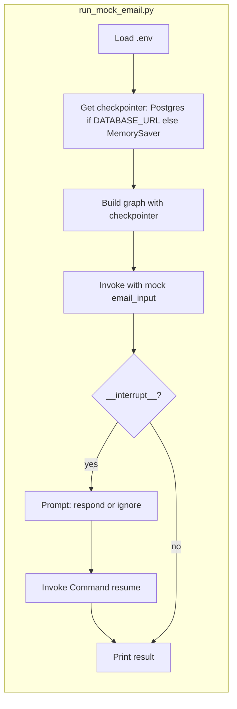

# Mock emails and Supabase checkpointer

## Goal

1. **Use mock emails** for testing HITL and interrupts (no Gmail API read).
2. **Use a checkpointer whenever the graph runs** outside Studio, and **store it in Supabase** when `DATABASE_URL` is set.

## Current state

- **Checkpointer:** [run_agent.py](scripts/run_agent.py) and [watch_gmail.py](scripts/watch_gmail.py) already use Postgres when `DATABASE_URL` is set, else MemorySaver. [checkpointer.py](src/email_assistant/db/checkpointer.py) uses `PostgresSaver.from_conn_string(DATABASE_URL)` and `setup()` creates LangGraph tables (`checkpoints`, `checkpoint_blobs`, etc.) in that Postgres. So **Supabase** = set `DATABASE_URL` to your Supabase Postgres connection string (Project Settings → Database → Connection string) and run `uv run python scripts/setup_db.py` once.
- **Mock emails:** Not yet centralized; [run_agent.py](scripts/run_agent.py) supports `RUN_EMAIL`_* env vars for manual email payload. No dedicated mock fixtures or script for HITL testing.

---

## 1. Mock email fixtures

Add a small module that defines **mock `email_input` payloads** used for local/testing and HITL demos.

**Location:** `src/email_assistant/fixtures/mock_emails.py` (new).

**Content:**

- **MOCK_EMAIL_NOTIFY** — Subject/body chosen so the triage LLM is likely to classify as **notify** (e.g. “FYI: deploy finished”, “Reminder: deadline tomorrow”). Use this to hit the interrupt and test resume.
- **MOCK_EMAIL_RESPOND** — Clearly asks for a reply (e.g. “Can you send me the report by Friday?”).
- **MOCK_EMAIL_IGNORE** — Low-priority (e.g. newsletter subject, generic marketing body).

Each fixture is a dict: `{"from": "...", "to": "...", "subject": "...", "body": "..."}`. Optional `"id"` can be a fake id (e.g. `"mock-1"`) for tests that need `email_id` (mark_as_read will no-op for non-Gmail ids). Export a list or dict of named mocks so a script or test can pick one by name.

**Alternative:** Store the same payloads in `tests/fixtures/mock_emails.json` and load in Python. Prefer a single source (one module or one JSON file) to avoid duplication.

---

## 2. Script: run with mock email and optional resume

Add a script that runs the graph with a **mock email** and, when an interrupt occurs, **resumes** with a user-chosen value. This demonstrates HITL without Gmail API.

**Location:** `scripts/run_mock_email.py` (new).

**Behavior:**

- Load `.env`.
- **Checkpointer:** If `DATABASE_URL` is set, use `postgres_checkpointer()` (Supabase/Postgres); else use `MemorySaver()`. Build the graph with that checkpointer so HITL state is persisted (and in Supabase when `DATABASE_URL` is set).
- **Input:** Use a mock email from the fixtures (e.g. `MOCK_EMAIL_NOTIFY` by default). Allow override via env (e.g. `MOCK_EMAIL=respond`) or CLI arg to select which fixture.
- **Invoke** with `email_input` and a fixed `thread_id` (e.g. `mock-hitl-1`).
- If the result has `**__interrupt`__**, print the interrupt payload and instructions, then **prompt** the user: “Resume with (r)espond or (i)gnore?”. On input, call `graph.invoke(Command(resume="respond")` or `Command(resume="ignore"), config=config)` and print the final result (e.g. last message or classification).
- If no interrupt, print the usual summary (e.g. classification, last message).

**Dependencies:** Use existing `build_email_assistant_graph`, `postgres_checkpointer`, `MemorySaver`, and `Command` from `langgraph.types`. No new packages.

---

## 3. Prefer Supabase checkpointer and ensure it exists

**Code:**

- In [run_agent.py](scripts/run_agent.py) and [watch_gmail.py](scripts/watch_gmail.py), use `**get_checkpointer()`** from [db/checkpointer.py](src/email_assistant/db/checkpointer.py) instead of duplicating the “if DATABASE_URL then postgres else MemorySaver” logic. Today `get_checkpointer()` returns either the context manager or a MemorySaver; callers must support both (e.g. `with get_checkpointer() as cp` if it’s a context manager, else use the returned instance). So either:
  - **Option A:** Keep current explicit `if database_url: with postgres_checkpointer()... else MemorySaver()` in run_agent and watcher (no change), **or**
  - **Option B:** Extend `get_checkpointer()` so it returns a concrete checkpointer instance when DATABASE_URL is set (e.g. enter the context manager once at startup and yield the same instance), and use that single helper in run_agent, watch_gmail, and run_mock_email. Option B reduces duplication but may require a small refactor of `get_checkpointer()` and call sites.

Recommend **Option A** for minimal change: keep current behavior, add a short comment in run_agent and watcher that when `DATABASE_URL` is set it should be the **Supabase Postgres** connection string so checkpoints are stored in Supabase.

**Documentation:**

- In [CONFIGURATION.md](docs/CONFIGURATION.md) (or [RUNNING_AND_TESTING.md](docs/RUNNING_AND_TESTING.md)): state that for **HITL and resume** (and for mock-email testing), set `**DATABASE_URL`** to your **Supabase Postgres** connection string (Supabase dashboard → Project Settings → Database → Connection string). Run `**uv run python scripts/setup_db.py`** once so LangGraph checkpointer tables exist; after that, checkpoint data is stored in Supabase.
- In [DATABASE.md](docs/DATABASE.md): clarify that “LangGraph checkpointer” uses **direct Postgres** via `DATABASE_URL`; when that URL is Supabase’s Postgres, checkpoints are stored in Supabase (same DB as app tables). No code change to checkpointer itself beyond comments/docs.

---

## 4. Optional: ensure checkpointer tables exist before run

If you want “add checkpointer if not exists” to mean **creating tables when missing**:

- When `DATABASE_URL` is set and we are about to build the graph with Postgres, call `**checkpointer.setup()`** (already done inside `postgres_checkpointer()` context in [checkpointer.py](src/email_assistant/db/checkpointer.py)). So the first time you use `postgres_checkpointer()` in a run, `setup()` runs and creates tables. No extra “if not exists” step is strictly required; `setup()` is idempotent. Optionally document: “On first use with DATABASE_URL, run `setup_db.py` once to create checkpoint (and store) tables.”

---

## Summary of changes

| Item             | Action                                                                                                                                                                                                                     |
| ---------------- | -------------------------------------------------------------------------------------------------------------------------------------------------------------------------------------------------------------------------- |
| **Fixtures**     | Add `src/email_assistant/fixtures/mock_emails.py` (or `tests/fixtures/mock_emails.json`) with at least `MOCK_EMAIL_NOTIFY`, `MOCK_EMAIL_RESPOND`, `MOCK_EMAIL_IGNORE`.                                                     |
| **Script**       | Add `scripts/run_mock_email.py`: run graph with mock email, use Postgres checkpointer when `DATABASE_URL` set else MemorySaver, on interrupt prompt and resume with `Command(resume="respond")` or `"ignore"`.             |
| **Checkpointer** | Keep using Postgres when `DATABASE_URL` is set; document that `DATABASE_URL` should be Supabase Postgres for checkpoints in Supabase; optionally centralize via `get_checkpointer()` (Option B) or leave as-is (Option A). |
| **Docs**         | Update CONFIGURATION.md and/or RUNNING_AND_TESTING.md and DATABASE.md: Supabase = set DATABASE_URL to Supabase Postgres, run setup_db once; mock-email script for HITL testing.                                            |

---

## Flow (mock email + Supabase checkpointer)

Checkpoint data is written to Postgres (Supabase when `DATABASE_URL` points there) on each step so that resume uses the same thread state.