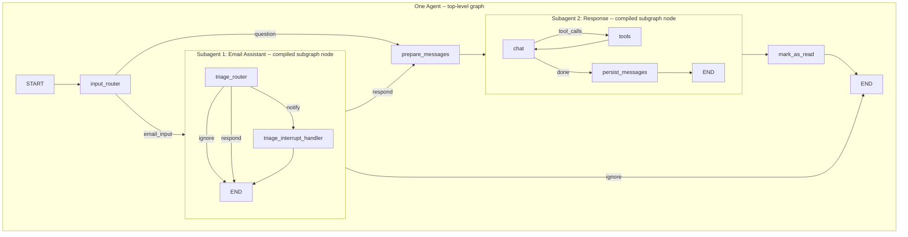

# One graph with two subagents under the same agent

## Goal

- **One agent** = one compiled graph, one entry point (`email_assistant_hitl_memory_gmail.py`).
- **Two subagents** under that agent:
  1. **Email Assistant subagent** -- triage (ignore / notify / respond) and HITL (`interrupt()` for notify).
  2. **Response subagent** -- chat, tools (send email, question, done), persist_messages; handles both question mode and "respond" path after triage.

Single graph, single entry, no separate "simple_agent" product.

## Target design




## Key design decisions

### 1. `State` includes `user_message` and `question`

Currently `input_router` reads `state.get("user_message")` and `state.get("question")` (line 53 of `input_router.py`), but `State` does not declare these keys -- they only exist in `StateInput`. This means if a caller passes `{"user_message": "Hello"}`, the value is silently dropped before it reaches `input_router` because LangGraph validates state against the schema.

**Fix:** Add `user_message` and `question` as optional fields to `State`. Additionally, use `StateInput` as the graph's input type via `StateGraph(State, input=StateInput)` so LangGraph knows the input shape can differ from the full state.

Updated `State`:

```python
State = TypedDict(
    "State",
    {
        "messages": Annotated[list, add_messages],
        "email_input": Optional[dict],
        "classification_decision": Optional[ClassificationDecision],
        "email_id": Optional[str],
        "_notify_choice": Optional[str],
        "user_message": Optional[str],
        "question": Optional[str],
    },
)
```

### 2. Both subgraphs use `State` (not `MessagesState`)

Currently `simple_agent.py` uses `StateGraph(MessagesState)` which only has `messages`. For the subgraph-as-node pattern to work cleanly, **both subgraphs must use `State`** so the parent can pass full state through without manual mapping.

**Change:** Update `simple_agent.py` to use `StateGraph(State)`. The chat, tools, and persist_messages nodes already only read/write `state["messages"]`, so they work with `State` unchanged -- they just ignore the extra keys.

### 3. Email Assistant subgraph must be a compiled subgraph node (not a function node)

The Email Assistant subgraph uses `interrupt()` in `triage_interrupt_handler`. For `interrupt()` to propagate correctly to the parent graph:

- The subgraph must be **added as a compiled graph** via `builder.add_node("email_assistant", compiled_subgraph)`.
- The parent must be compiled with a checkpointer.
- When streaming, use `subgraphs=True` so interrupt signals from the inner subgraph are visible.

This is NOT the same as a wrapper function that calls `subgraph.invoke(...)` -- LangGraph needs to see the compiled graph as a node to handle interrupt propagation.

### 4. Inside the Email Assistant subgraph: `triage_interrupt_handler` always exits to END

Currently `after_triage_interrupt_route` returns `"response_agent"` for the respond case (line 37 of `triage_interrupt.py`). But inside the Email Assistant subgraph, there is no node called `"response_agent"` -- the subgraph only has `triage_router` and `triage_interrupt_handler`.

**Fix:** Inside the subgraph, `triage_interrupt_handler` always exits to the subgraph's own END (unconditional edge). Both respond and ignore outcomes write to state (`_notify_choice`), and then the subgraph ends. The **parent** graph reads `classification_decision` and `_notify_choice` from state after the subgraph exits and routes accordingly. So `after_triage_interrupt_route` is no longer used as a conditional edge -- it can be removed or kept unused.

Subgraph edges:

- START --> triage_router
- triage_router --> conditional: ignore --> END, notify --> triage_interrupt_handler, respond --> END
- triage_interrupt_handler --> END (unconditional -- no conditional edge needed)

### 5. `prepare_messages` node handles reply-context injection

Currently `response_agent_node` does two things: (a) injects a HumanMessage with email context when `email_id`/`email_input` are set, (b) invokes the response subgraph. With the subgraph-as-node pattern, (b) is handled by adding the compiled subgraph directly as a node. So (a) needs its own node: `**prepare_messages`**.

- `prepare_messages` runs between the Email Assistant subgraph (or input_router for question mode) and the Response subgraph.
- If `email_id` and `email_input` are set: prepend a HumanMessage with reply context (same text as current `response_agent.py` lines 44-53).
- If only `user_message`/`question`: messages are already set by `input_router`; no change needed.
- Always passes through to the Response subgraph.

### 6. Single routing function after Email Assistant subgraph

When the Email Assistant subgraph exits, the parent needs ONE conditional edge:

- `classification_decision == "respond"` (direct respond) --> `prepare_messages`
- `_notify_choice == "respond"` (user chose respond after notify interrupt) --> `prepare_messages`
- Everything else (ignore, or notify-then-ignore) --> END

This replaces the current two separate routing functions (`_after_triage_route` and `after_triage_interrupt_route`).

### 7. Studio: one graph entry

`langgraph.json` will have one graph entry: `email_assistant`. The `simple_agent` entry is removed. If you invoke the graph with just `{"user_message": "Hello"}` and no `email_input`, it skips triage and goes straight to prepare_messages -> response subgraph. That IS the "simple agent" -- same graph, question mode.

## Implementation steps

### Step 1: Update `schemas.py` -- add `user_message` and `question` to `State`

- Add `"user_message": Optional[str]` and `"question": Optional[str]` to `State`.
- Keep `StateInput` as-is (used as graph input type).
- `MessagesState` can remain for backward compat but is no longer used in any graph.

### Step 2: Update `simple_agent.py` to use `State`

- Change `StateGraph(MessagesState)` to `StateGraph(State)` in `build_simple_graph()`.
- Change node type hints from `MessagesState` to `State` (for `_chat_node`, `_should_continue`, `_persist_messages_node`). These functions only read `state["messages"]` so no logic changes.
- Rename function to `build_response_subgraph()` (clearer name).
- Remove the module-level `graph = build_simple_graph()` (no longer needed as a standalone Studio entry).

### Step 3: Create `prepare_messages` node

- New file `nodes/prepare_messages.py`.
- Function `prepare_messages(state: State) -> dict`:
  - If `email_id` and `email_input` set: prepend reply-context HumanMessage to `state["messages"]`, return `{"messages": updated_messages}`.
  - Otherwise: return `{}` (messages already set by input_router).

### Step 4: Build the Email Assistant subgraph

- New function `build_email_assistant_subgraph()` in `email_assistant_hitl_memory_gmail.py`.
- `StateGraph(State)` with nodes: `triage_router`, `triage_interrupt_handler`.
- Edges:
  - START --> triage_router.
  - triage_router --> conditional: ignore --> END, notify --> triage_interrupt_handler, respond --> END.
  - triage_interrupt_handler --> END (unconditional -- both respond and ignore write to `_notify_choice` and exit; parent routes).
- `return builder.compile()` (no checkpointer -- parent's checkpointer handles interrupt).

### Step 5: Wire the top-level graph in `email_assistant_hitl_memory_gmail.py`

```python
def build_email_assistant_graph(checkpointer=None):
    email_subgraph = build_email_assistant_subgraph()
    response_subgraph = build_response_subgraph()  # from simple_agent

    builder = StateGraph(State, input=StateInput)
    builder.add_node("input_router", input_router)
    builder.add_node("email_assistant", email_subgraph)        # compiled subgraph as node
    builder.add_node("prepare_messages", prepare_messages)
    builder.add_node("response_agent", response_subgraph)      # compiled subgraph as node
    builder.add_node("mark_as_read", mark_as_read_node)

    builder.add_edge(START, "input_router")
    builder.add_conditional_edges("input_router", _after_input_router_route, {
        "email_assistant": "email_assistant",
        "prepare_messages": "prepare_messages",
    })
    builder.add_conditional_edges("email_assistant", _after_email_assistant_route, {
        "prepare_messages": "prepare_messages",
        "__end__": END,
    })
    builder.add_edge("prepare_messages", "response_agent")
    builder.add_edge("response_agent", "mark_as_read")
    builder.add_edge("mark_as_read", END)

    cp = checkpointer if checkpointer is not None else MemorySaver()
    return builder.compile(checkpointer=cp)
```

Routing functions:

- `_after_input_router_route(state)`: if `email_input` --> `"email_assistant"`, else --> `"prepare_messages"`.
- `_after_email_assistant_route(state)`: if `classification_decision == "respond"` OR `_notify_choice == "respond"` --> `"prepare_messages"`, else --> `"__end__"`.

### Step 6: Clean up files

- **Delete** `nodes/response_agent.py` (its job is replaced by `prepare_messages` + compiled subgraph node).
- **Update** `nodes/__init__.py`: remove `response_agent_node`; add `prepare_messages`.
- **Update** `simple_agent.py`: rename builder to `build_response_subgraph()`; remove module-level `graph = ...`.
- **Update** `langgraph.json`: remove `simple_agent` entry; keep only `email_assistant`.

### Step 7: Verify `run_agent.py`

- `scripts/run_agent.py` imports `build_email_assistant_graph` from `email_assistant.email_assistant_hitl_memory_gmail` -- this is unchanged.
- But the graph shape is different (subgraph nodes instead of flat nodes), so verify the script still runs correctly for both question mode (`RUN_MESSAGE`) and email mode (`RUN_EMAIL_*`).
- Check that the result dict still has `messages`, `classification_decision`, and `__interrupt__` where expected.

### Step 8: Update docs

- **ARCHITECTURE.md**: one agent with two subagents (Email Assistant, Response); update diagram; explain that `triage_interrupt_handler` exits to subgraph END and parent routes.
- **FILES_AND_MODULES.md**: remove response_agent.py; add prepare_messages.py; note simple_agent.py is now the Response subgraph builder.
- **RUNNING_AND_TESTING.md**: single Studio entry `email_assistant`; question mode is just invoking without `email_input`.

## Summary

- **One agent** = one top-level graph, one compile, one checkpointer.
- **Two subagents** = two compiled subgraphs added as nodes via `builder.add_node(name, compiled_graph)`:
  - (1) Email Assistant -- triage + interrupt (propagates correctly because it's a compiled subgraph node; `triage_interrupt_handler` always exits to subgraph END; parent reads state and routes).
  - (2) Response -- chat, tools, persist, send messages.
- `**prepare_messages`** = thin node between triage and response that injects reply context when needed.
- `**State` includes `user_message` and `question**` so `input_router` can read them; `StateInput` is the graph input type.
- **Both subgraphs use `State`** so state flows through without manual mapping.
- **One Studio entry** (`email_assistant`); question mode = same graph without `email_input`.

