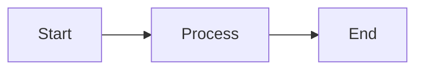
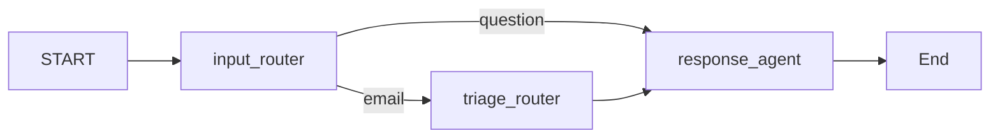
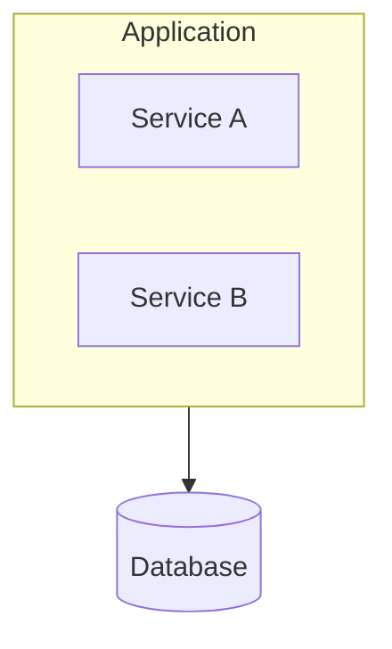

# Mermaid diagram

Generate Mermaid diagrams as a **single markdown code block** (fenced with ` ```mermaid `) so they can be pasted into any `.md` file.

## When to use

- User asks for a flowchart, sequence diagram, architecture diagram, state machine, ER diagram, or "mermaid diagram"
- Adding or updating diagrams in docs (e.g. ARCHITECTURE.md) or plan files
- Explaining flows, processes, or system design visually

## Diagram types

| Type | Use for |
|------|--------|
| `flowchart LR` or `flowchart TB` | Processes, pipelines, step flows (LR = left-right, TB = top-bottom) |
| `sequenceDiagram` | Interactions between actors over time |
| `stateDiagram-v2` | State machines |
| `erDiagram` | Entity-relationship / database schema |
| `classDiagram` | Classes and relationships |

## Syntax rules (required for correct rendering)

- **Node IDs**: No spaces. Use `camelCase`, `PascalCase`, or underscores (e.g. `UserService`, `response_agent`). Bad: `User Service`.
- **Edge labels** with parentheses or special characters: wrap in quotes, e.g. `A -->|"O(1) lookup"| B`.
- **Node labels** with special characters: use double quotes, e.g. `A["Process (main)"]`, `B["Step 1: Init"]`.
- **Reserved IDs**: Do not use `end`, `subgraph`, `graph`, `flowchart` as node IDs; use e.g. `endNode[End]`.
- **Subgraphs**: Use explicit ID and label, e.g. `subgraph id [Label]` (e.g. `subgraph auth [Authentication Flow]`).
- **No styling**: Do not use `style`, `classDef`, or `:::style`; they break in dark mode.
- **No `click`**: Not supported for security.

## Output format

Always output the diagram as one code block:



If the user wants the diagram inline in a doc, output the block so they can copy it. Do not embed raw Mermaid without the fence.

## Example: flowchart



## Example: subgraph



If the user's intent is unclear, ask what they want to show (flow, sequence, states, schema, etc.) before choosing the diagram type.

## Scripts (render and fix errors)

Scripts live under `.cursor/skills/mermaid-diagram/scripts/`. Run them from the skill folder or pass absolute paths.

### Render (Mermaid → SVG/PNG)

- **Cross-platform (recommended):**  
  `python scripts/render.py <input.md|input.mmd|-> [output.svg]`  
  Uses `npx @mermaid-js/mermaid-cli` (mmdc). Requires Node.js.
- **Unix/macOS:**  
  `./scripts/render.sh <input.md|input.mmd|-> [output.svg]`

Input can be a `.md` file (first ` ```mermaid ` block is used), a `.mmd` file, or `-` for stdin. Default output is `output.svg`; use a second argument or `-o path.svg` to set the output path.

### When the renderer reports errors

1. Run the **fix script** to apply common syntax fixes (reserved IDs, unquoted edge labels, subgraph labels):  
   `python scripts/fix_errors.py path/to/file.md`  
   Prints fixed Mermaid to stdout. Use `-o fixed.mmd` to write to a file.
2. Update the source: replace the diagram in the `.md` (or overwrite the `.mmd`) with the fixed output, then render again.
3. If errors persist, use the renderer’s error message (e.g. line number, “Parse error”) and the **Syntax rules** above to correct the diagram manually (e.g. node IDs without spaces, no `style`/`classDef`/`click`).

### Fix script usage

- `python scripts/fix_errors.py diagram.mmd` — print fixed Mermaid to stdout  
- `python scripts/fix_errors.py file.md -o fixed.mmd` — write fixed Mermaid to `fixed.mmd`  
- `python scripts/fix_errors.py -` — read from stdin, print to stdout
